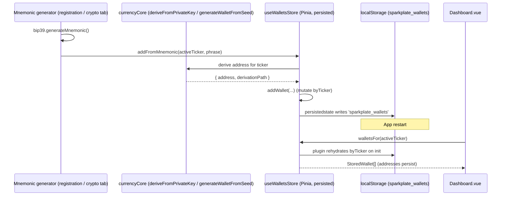

# Execution: Pinia foundation + service-backed `useContactsStore`

**Date:** June 9, 2026 (`20260609`, from `date +%Y%m%d`)
**Category:** State architecture / Vuex→Pinia migration
**Status:** Implemented — Phase 0 complete; first domain store (contacts) wired into the AddressBook view
**Driving documents:**
- Methodology: `docs/methodologies/06032026.methodology.vuex.to.pinia.store.conversion.md`
- Finding: `docs/findings/06032026.sparkplate.findings.addressbook.localStorage.persistence.md`
- Reference codebase: `Greenery/` (Vue 2.7 + Vuex 3) — `src/store/contactModule.js`

---

## 1. Overview

This execution introduces **Pinia** to Sparkplate.Fresh and lands the **first real domain store**,
`useContactsStore`, wired into `src/views/AddressBook.vue`. It implements **Phase 0** of the
Vuex→Pinia methodology end-to-end and a vertical slice of **Phase 2/3** (the contacts module + the
AddressBook view).

The contacts slice was chosen first because it is the subject of the address-book persistence finding
and maps cleanly from Greenery's `contactModule`, while carrying **zero Electron `window.cryptos`
risk** (Phase 4) — it only touches the existing `localStorage`-backed services.

The single most important architectural decision, taken directly from the finding and methodology §3.5:

> **Contacts persistence stays in `src/services/addressBook/*`. The Pinia store does NOT enable
> `persist`.** The service remains the one source of truth for `localStorage`; the store is a thin,
> reactive wrapper. This avoids double-persisting the same data under a second key and the resulting
> drift between store JSON and service JSON.

---

## 2. What was implemented

### 2.1 Phase 0 — Pinia bootstrap

| Item | Detail |
|------|--------|
| Packages | `npm install pinia pinia-plugin-persistedstate --save-exact --legacy-peer-deps` |
| Installed | `pinia@3.0.4`, `pinia-plugin-persistedstate@4.7.1` |
| New file | `src/stores/index.ts` — `createPinia()` + `pinia.use(piniaPluginPersistedstate)` |
| Wiring | `src/main.ts` — `app.use(pinia)` **before** `app.use(router)` (so future route guards can read stores) |

`--legacy-peer-deps` was required because the repo has a **pre-existing** peer-dependency conflict
(`@tezos-domains/taquito-client` pins `@taquito/taquito@23.0.2` while the project uses `23.1.0`). This
is unrelated to Pinia; the existing `node_modules` was already installed under the same flag.

The persistedstate plugin is registered globally now so future stores (e.g. `useSettingsStore`,
`useCoinsStore`) can opt in with `{ persist: { key, pick: [...] } }`. It replaces Greenery's
`vuex-persistedstate` (SecureLS) and, via its built-in `storage`-event sync, the `vuex-shared-mutations`
cross-window behavior — the same mechanism `useDashboardCurrencies.ts` already uses.

### 2.2 Phase 2/3 — `useContactsStore` (new file `src/stores/useContactsStore.ts`)

A **setup-style** store (`defineStore('contacts', () => { ... })`, per methodology §3.2) that wraps the
contact + wallet services. Vuex→Pinia mapping applied:

| Greenery `contactModule.js` | `useContactsStore.ts` |
|-----------------------------|-----------------------|
| `state.list` | `contacts` ref (`DisplayContact[]` — contact + per-row `wallets` count) |
| getter `getContactById(id)` | `getContactById` computed factory |
| getter `contactWalletCount(id)` | folded into each row's `wallets` count during `loadContacts` |
| action `loadContacts` | `loadContacts()` → `getContacts()` + `getWalletCountForContact()` |
| actions `dropDownContacts` / `importContacts` / `importVcardContact` | `importRows(rows)` |
| actions `insertContact` / `updateContact` | `saveContact(contact)` (insert when `id == null`, else update) |
| action `removeContactById` | `removeContacts(ids)` |
| mutation `resetContactsState` | `reset()` (clears in-memory list only — see §5) |

No `persist` block (service-owned data). The store exposes `contacts`, `loading`, `count`,
`getContactById`, `loadContacts`, `importRows`, `saveContact`, `removeContacts`, `reset`.

### 2.3 View wiring — `src/views/AddressBook.vue`

- Replaced the local `contacts` ref + local `DisplayContact` interface with the store:
  `const { contacts } = storeToRefs(useContactsStore())` and `import type { DisplayContact }`.
- `loadContacts()` now delegates to `contactsStore.loadContacts()`, then performs UI-only follow-ups
  (`closeConfirmModal()` + refresh of the derived **Companies** tab via new `refreshDerivedTabs()`).
- `addContacts()` (import handler) now calls `contactsStore.importRows()` — the contact-build +
  `coin://address` wallet-splitting logic moved into the store.
- The bulk-delete path in `onConfirmDelete()` now calls `contactsStore.removeContacts()`.
- Removed now-unused service imports (`getContacts`, `addContact`, `deleteContact`,
  `getWalletCountForContact`); kept `addWallet` (still used by the add-currency modal handler) and the
  `Contact` type.

Exchanges, Wallets, and Companies tabs were intentionally left on direct service calls to keep this
slice minimal; they are scheduled for later phases (see §6).

---

## 3. Files changed

| File | Change |
|------|--------|
| `package.json` / `package-lock.json` | Added `pinia` + `pinia-plugin-persistedstate` |
| `src/stores/index.ts` | **New** — Pinia instance + persistedstate plugin |
| `src/stores/useContactsStore.ts` | **New** — contacts setup store (service-backed) |
| `src/main.ts` | Import `pinia`; `app.use(pinia)` before router |
| `src/views/AddressBook.vue` | Wired contacts list/import/delete to the store |

---

## 4. Verification

- **Type check:** `npx vue-tsc --noEmit --skipLibCheck` — **0 errors in changed files**
  (`src/stores/*`, `src/main.ts`, `src/views/AddressBook.vue`).
- **Linter:** no lint errors in the changed files.
- **Pre-existing errors (out of scope):** 193 TypeScript errors remain, all confined to
  `src/lib/cores/currencyCore/**` (oracle / distribution-engine / DEX files). These are genuine
  pre-existing syntax errors — e.g. `oracles/XTZ.Tezos/kaiko.ts:208` contains a malformed escaped
  backtick `` \`\${asset...}\` `` — and predate this work. They were **not** introduced here and are
  not touched by this slice.

### Manual smoke test (recommended before merge)

1. `npm run dev`, open Address Book.
2. Import a `.vcf` / `.csv`; confirm rows appear and wallet counts render.
3. Restart the app; confirm contacts persist (still served by `sparkplate.addressbook.contacts.v1`).
4. Confirm only the service keys exist in DevTools → Local Storage (no duplicate Pinia contacts key).
5. Bulk-select + delete; confirm rows and the derived Companies tab update.

---

## 5. Decisions & notes

- **No double persistence.** Per the finding, `reset()` clears only the in-memory list — it does **not**
  wipe `localStorage`. A true logout/wipe would need a new `clearAddressBook()` service API
  (finding §"Logout / reset"); deferred as a conscious product decision.
- **Setup stores** chosen over options stores for consistency with the Composition-API majority and the
  KeyForge reference store (methodology §3.2).
- **`--legacy-peer-deps`** is a workaround for the pre-existing taquito peer conflict, not a Pinia issue.

---

## 6. Deferred (next phases per methodology §7)

- [ ] **Phase 1 foundation stores:** `useSettingsStore` (absorb `useMenuState` + `useDashboardCurrencies`,
      add `persist`), `useCoinsStore`, `useAccountsStore`; convert the Greenery global mixin to composables.
- [ ] **Phase 2 remaining domain stores:** invoices, activities, quickExchange, mnemonicPasswords, exchanges.
- [ ] **Phase 3 views:** migrate Exchanges / Wallets / Companies tabs (and other route views) to stores.
- [ ] **Phase 4:** Electron `window.cryptos` / `window.fs` / `window.storage` / `window.notification` IPC
      bridges + wallet/transaction/fees/paperWallet/web3 stores; rewrite legacy `TwoFactorAuth.vue` /
      `MiscSecurity.vue`. Note: the **address-only** `useWalletsStore` slice (§8) can land *before* this —
      address derivation already runs in-renderer via `currencyCore`, so persistent Dashboard wallet
      addresses need no IPC; only balances/secrets are gated on the crypto bridge.
- [ ] **Phase 5:** configure `persist` for settings + coins, verify cross-window sync, add `$reset()` on
      logout for every store, remove all `vuex*` references, packaging smoke test.
- [ ] Address the pre-existing `currencyCore` syntax errors (separate, unrelated cleanup).

---

## 7. Router vs. Pinia store — how they compare

A useful way to understand Pinia in this app is to compare it to the thing already wired the same way:
**Vue Router**. Both are Vue plugins, both are singletons, and `main.ts` now installs them side by side.

### 7.1 Structural similarities

```4:6:src/main.ts
import router from './router'
import { pinia } from './stores'
import moment from 'moment'
```

```39:42:src/main.ts
    app
      .use(pinia)   // before router so route guards can read stores
      .use(router)
      .mount('#app')
```

| Aspect | Vue Router (`src/router/index.ts`) | Pinia (`src/stores/index.ts`) |
|--------|-----------------------------------|-------------------------------|
| Creation | `createRouter({ history, routes })` once at module scope | `createPinia()` once at module scope |
| Install | `app.use(router)` | `app.use(pinia)` (registered **first**) |
| Access in `<script setup>` | `useRoute()` / `useRouter()` | `useXxxStore()` + `storeToRefs()` |
| Reactivity | the current route is a reactive object | each store's refs/computeds are reactive |
| Cardinality | exactly **one** reactive "current route" | **many** independent stores |
| Concern | *which screen* is shown | *what data* the screens render |

So they are **complementary, not competing**: the Dashboard already uses the router to navigate
(`<RouterLink to="/settings/dashboard">`), while the store(s) hold the data each route renders.

### 7.2 The key difference: persistence model

The router and a store differ most in **how state survives a reload**:

- **The router persists "location" for free** — it is encoded in the URL/hash. Sparkplate uses
  `createWebHashHistory()`, so the active route lives in `window.location.hash` and is automatically
  restored on reload/restart. The address bar *is* the router's persistence layer.
- **A Pinia store persists nothing by default.** Its refs are in-memory and reset on reload unless you
  opt in via (a) the `pinia-plugin-persistedstate` plugin, or (b) a `localStorage`/DB-backed service
  the store wraps (the approach `useContactsStore` takes).

In other words: **the router's hash is to navigation what `localStorage`/persistedstate is to store
data.** This is the same insight behind `useContactsStore` deferring persistence to the service, and
behind the Dashboard already hand-rolling a tiny "persistence layer" for its active ticker
(`sparkplate_dashboard_default_ticker`) — see `src/views/Dashboard.vue` `selectCurrency()` /
`readDefaultTicker()`.

### 7.3 Greenery (V1) vs. Sparkplate (V2)

| | Greenery (Vue 2 + Vuex 3 + vue-router 3) | Sparkplate (Vue 3 + Pinia + vue-router 4) |
|--|------------------------------------------|-------------------------------------------|
| Registration | `new Vue({ store, router })` — both injected on the root | `app.use(pinia); app.use(router)` — both plugins |
| Store access | options API: `this.$store`, `mapState/mapActions` | composables: `useStore()`, `storeToRefs()` |
| Router access | `this.$route` / `this.$router` | `useRoute()` / `useRouter()` |
| Store persistence | `vuex-persistedstate` (SecureLS) + `vuex-shared-mutations` | `pinia-plugin-persistedstate` (`storage` event covers cross-window) |
| Router history | vue-router 3 hash/history | `createWebHashHistory()` |

The mental model is unchanged across the migration; only the registration and access APIs changed
(`this.$store`/`this.$route` → `useStore()`/`useRoute()`).

---

## 8. From a mnemonic seed phrase to persistent wallet addresses on the Dashboard

This section ties the two mnemonic generators to the Dashboard and shows how Pinia closes the gap that
exists today — and how Greenery solved the same problem with Vuex.

### 8.1 The gap today (no persistence)

The crypto already works; **persistence is the missing layer.**

- **Both generators only produce a phrase, locally.**
  - Registration `03.registration.mnemonicHDSeedPhrase.vue` calls `bip39.generateMnemonic(entropyBits)`
    and, on verify, `emit('confirm', entered)` — the phrase leaves via an event and nothing derives or
    stores addresses.
  - The cryptocurrency tab `tab.cryptocurrency.MnemonicSeedPhrase.vue` keeps the phrase in a local
    `mnemonic` ref (`generateMnemonic()` / file import) and only ever exports it (JSON/TXT/CSV/PNG/PDF).
- **The Dashboard's wallet hooks are stubs.** In `src/views/Dashboard.vue`:

```358:361:src/views/Dashboard.vue
function onNewWalletFromMnemonic(): void {
  /* TODO: wire up mnemonic → wallet flow once the V2 wallet store lands. */
  console.info('[Dashboard] new wallet from mnemonic:', activeTicker.value)
}
```

So a generated phrase never becomes a wallet address, and the Wallets tab always shows
"No … wallets yet". The phrase, derived addresses, and the Dashboard are three disconnected islands.

- **The derivation core already exists** — no Electron/IPC needed for address generation. Per-currency
  modules under `src/lib/cores/currencyCore/currencies/*` expose `deriveFromPrivateKey()` and seed-based
  derivation (e.g. BCH `generateWalletFromSeed(seed, index, network)` using `HDKey.fromMasterSeed` and
  paths like `m/44'/145'/0'/0/${index}`), plus the unified `generateMultiFormatAddresses(ticker, …)` in
  `currencies/ext/multiFormatAddresses.tsx`.

**Conclusion:** the only missing piece is a **store that owns derived wallets and persists them** —
exactly the role Greenery's `walletModule` played.

### 8.2 Proposed `useWalletsStore` (Pinia) — the bridge

A setup store keyed by currency identifier (mirroring Greenery's coin-map shape `state[identifier] =
Wallet[]`), persisted via the plugin since there is **no** wallet service today (unlike contacts):

```typescript
// src/stores/useWalletsStore.ts  (proposed — Phase 4 slice, address-only)
import { defineStore } from 'pinia'
import { ref, computed } from 'vue'
import { currencyByTicker } from '@/lib/cores/currencyCore/currencies'

export interface StoredWallet {
  ticker: string          // 'BTC'
  address: string         // PUBLIC — safe to persist
  derivationPath?: string
  isHDWallet: boolean
  balance: number
  // NOTE: privateKey / wif are intentionally NOT stored here (see §8.4)
}

export const useWalletsStore = defineStore('wallets', () => {
  const byTicker = ref<Record<string, StoredWallet[]>>({})

  const walletsFor = computed(() => (ticker: string) => byTicker.value[ticker.toUpperCase()] ?? [])

  function addWallet(w: StoredWallet) {
    const key = w.ticker.toUpperCase()
    byTicker.value = { ...byTicker.value, [key]: [w, ...(byTicker.value[key] ?? [])] }
  }

  /** Derive an address for `ticker` from a BIP39 mnemonic, then store it. */
  async function addFromMnemonic(ticker: string, mnemonic: string) {
    const currency = currencyByTicker[ticker]
    // derive privateKey → address via the existing per-currency core, then:
    const { derived } = await /* generateMultiFormatAddresses(...) or currency.generateWalletFromSeed(...) */
    addWallet({ ticker, address: derived.address, isHDWallet: true, balance: 0 })
  }

  function reset() { byTicker.value = {} }

  return { byTicker, walletsFor, addWallet, addFromMnemonic, reset }
}, {
  // Wallets have no localStorage service today, so (unlike contacts) the STORE owns persistence.
  persist: { key: 'sparkplate_wallets', pick: ['byTicker'] },
})
```

### 8.3 Wiring the two generators → store → Dashboard



Concretely:
- **Registration** already emits the phrase — its parent handler would call
  `useWalletsStore().addFromMnemonic(ticker, mnemonic)` instead of dropping it.
- **Crypto tab** would add a "Send to Dashboard" action calling the same store method with its
  `mnemonic` ref.
- **Dashboard** replaces the empty-state and the stub handlers: `onNewWalletFromMnemonic` /
  `onWalletImported` call the store; the Wallets tab renders `walletsStore.walletsFor(activeTicker)`;
  the footer "Total Balance" can sum from the store. Because the store is persisted, addresses survive
  restart — matching the address-book persistence pattern, just owned by the store rather than a service.

### 8.4 How Greenery did wallet addresses with Vuex (comparison)

Greenery's `walletModule.js` is the direct ancestor:

| Step | Greenery (Vuex 3) | Sparkplate (proposed Pinia) |
|------|-------------------|-----------------------------|
| Where the mnemonic lives | `rootState.accounts.hdWallet` — an `HDWalletService` instance holding `{ mnemonic, seed }` | passed in per call (`addFromMnemonic(ticker, phrase)`); no logged-in account required |
| Derivation | `generateWallet` action → `hdWallet.generateWallet()` → **`window.cryptos.generateWallet({ seed, coinTicker, network, derivationIndex })`** in the Electron main process | **in-renderer** via `currencyCore` (`deriveFromPrivateKey` / `generateWalletFromSeed`); `window.cryptos` does **not** exist in V2 |
| HD index | `getDerivationIndex` / `incrementWalletCounter` tracked next path | `derivationIndex` arg to the core (same idea; store can track per-ticker counter) |
| State shape | coin map at module root: `state[identifier] = Wallet[]` (e.g. `state.btc`, `state['usdt.eth']`) | `byTicker: Record<ticker, StoredWallet[]>` — same shape |
| Add to state | `addWalletToDB` (WalletService → DB) then `commit('addWallet', …)` | `addWallet()` mutates `byTicker` directly (no mutation layer in Pinia) |
| Persistence | wallets were **DB-backed** (WalletService) and rehydrated via `fetchDBWallets(userId)` on login; the SecureLS `vuex-persistedstate` slice was only `settings`/`coins`, **not** wallets | the **persistedstate plugin** persists `byTicker` to `localStorage`; no login/DB step needed |
| Balances | `getBalances`/`updateBalance` via `window.cryptos` + `window.notification` | deferred to Phase 4 (needs the crypto/notification IPC bridges) |

**Net difference:** Greenery derived addresses in the Electron main process and rehydrated wallets from
a per-user DB on login; Sparkplate can derive **entirely in the renderer** and persist with the
plugin, so "generate phrase → persistent address on the Dashboard" needs **no IPC and no account
system** — only the `useWalletsStore` above.

### 8.5 Security note (why "addresses" specifically)

The request is for persistent **wallet addresses**, and that distinction matters: an address (and
public key) is public data and safe to write to `localStorage`. **Private keys / WIF must not** be
persisted in plaintext — Greenery protected secrets with SecureLS and `window.storage.encryptBuffer`.
So `StoredWallet` deliberately omits `privateKey`/`wif`; persisting encrypted secrets is a separate
Phase 4 task gated on the crypto IPC bridge (§6).

---

## 9. References

- `docs/methodologies/06032026.methodology.vuex.to.pinia.store.conversion.md`
- `docs/findings/06032026.sparkplate.findings.addressbook.localStorage.persistence.md`
- `Greenery/src/store/contactModule.js`, `Greenery/src/store/walletModule.js`, `Greenery/src/service/HDWalletService.js`
- `src/composables/useDashboardCurrencies.ts` (blessed store-like pattern)
- `src/main.ts`, `src/router/index.ts`, `src/stores/index.ts` (router/store registration)
- `src/views/Dashboard.vue` (wallet hooks + active-ticker persistence)
- `src/components/authentication/registration/03.registration.mnemonicHDSeedPhrase.vue`,
  `src/components/pageTabs/cryptocurrency/tab.cryptocurrency.MnemonicSeedPhrase.vue` (mnemonic generators)
- `src/lib/cores/currencyCore/currencies/*` (in-renderer address derivation; e.g. BCH `generateWalletFromSeed`, `ext/multiFormatAddresses.tsx`)
- [Pinia docs](https://pinia.vuejs.org/), [pinia-plugin-persistedstate](https://prazdevs.github.io/pinia-plugin-persistedstate/)
