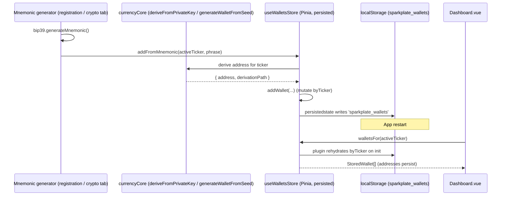

# Execution: Pinia foundation + service-backed `useContactsStore` (+ `useSettingsStore`)

**Date:** June 10, 2026 (`20260610`, from `date +%Y%m%d`)
**Category:** State architecture / Vuex→Pinia migration
**Status:** Implemented — Phase 0 complete; first domain store (contacts) wired into the AddressBook view; **Phase 1 foundational stores complete (`useSettingsStore` + `useCoinsStore` + `useAccountsStore`)**; address-only `useWalletsStore` landed and wired into `Dashboard.vue` (§8.7)
**Supersedes:** `docs/executions/20260609.execution.vuex.to.pinia.store.conversion.md` (adds the `useSettingsStore` slice + §8.6 Dashboard wallet-address persistence wiring, now implemented per §8.7)
**Driving documents:**
- Methodology: `docs/methodologies/06032026.methodology.vuex.to.pinia.store.conversion.md`
- Finding: `docs/findings/06032026.sparkplate.findings.addressbook.localStorage.persistence.md`
- Reference codebase: `Greenery/` (Vue 2.7 + Vuex 3) — `src/store/contactModule.js`, `src/store/walletModule.js`

---

## 0. Update log (since `20260609`)

- **Phase 1 `useSettingsStore` implemented.** A setup store (`src/stores/useSettingsStore.ts`) now owns
  `menuType`, `visibilityToggles`, and `networkSelection`, persisted via the plugin under
  `sparkplate_settings`. It **absorbs** the two existing composables — `useMenuState.ts` and
  `useDashboardCurrencies.ts` — which are now thin shims delegating to the store (so existing consumers
  needed no change beyond moving `NavBar.vue`'s `useMenuState()` call into `setup()`). A one-time
  migration seeds visibility from the legacy `sparkplate_dashboard_visibility` key.
- **Added §8.6** — a concrete, code-grounded walk-through of how Pinia makes **generated public wallet
  addresses persist** on `src/views/Dashboard.vue`, replacing today's three stub handlers.
- **`useWalletsStore` implemented + Dashboard wired (§8.7).** The address-only store
  (`src/stores/useWalletsStore.ts`) now persists `byTicker` under `sparkplate_wallets`, and
  `Dashboard.vue`'s three stub handlers (`onWalletImported`, `onNewWalletFromMnemonic`,
  `onNewWalletThrowaway`) now call the store; the Wallets tab renders the persisted addresses. See
  §8.7 for the as-built API and the deviations from the §8.2/§8.6 proposal.
- **Phase 1 foundation completed: `useCoinsStore` + `useAccountsStore` landed.**
  - `src/stores/useCoinsStore.ts` — market-data cache (price / 24h change / market cap) fetched via the
    currencyCore aggregator (`fetchCurrencyPrices`, CoinGecko→CoinCap→Coinpaprika fallback), persisted as a
    warm-start cache under `sparkplate_coins` (methodology §3.5). Exposes `fetchCoinPrices`/`fetchCoinsInfo`
    and `priceFor`/`marketCapFor`/`changeFor` lookups.
  - `src/stores/useAccountsStore.ts` — absorbs the former `src/composables/useAuth.ts` singleton (now a thin
    shim) into one source of truth (`active`/`all`/`authenticated`/`ip` + `user`/`loggedIn`). Real
    signup/login crypto + `fetchIP` stay deferred to Phase 4; not persisted (parity with Greenery + the old
    `useAuth`). All five `useAuth` consumers are unchanged. This closes the Phase 1 checklist in §6.
- **Added §9** — explanation of how to enable **real account creation & login** on top of `useAccountsStore`
  (an account service mirroring Greenery's `UserService`, hashing via the already-installed `scrypt-js`/PBKDF2,
  plus the signup/login component wiring) — no Electron/IPC required. References renumbered to §10.

---

## 1. Overview

This execution introduces **Pinia** to Sparkplate.Fresh and lands the **first real domain store**,
`useContactsStore`, wired into `src/views/AddressBook.vue`. It implements **Phase 0** of the
Vuex→Pinia methodology end-to-end and a vertical slice of **Phase 2/3** (the contacts module + the
AddressBook view), plus the **first Phase 1 foundational store** (`useSettingsStore`).

The contacts slice was chosen first because it is the subject of the address-book persistence finding
and maps cleanly from Greenery's `contactModule`, while carrying **zero Electron `window.cryptos`
risk** (Phase 4) — it only touches the existing `localStorage`-backed services.

The single most important architectural decision, taken directly from the finding and methodology §3.5:

> **Contacts persistence stays in `src/services/addressBook/*`. The Pinia store does NOT enable
> `persist`.** The service remains the one source of truth for `localStorage`; the store is a thin,
> reactive wrapper. This avoids double-persisting the same data under a second key and the resulting
> drift between store JSON and service JSON.

The complementary decision for **store-owned** data (settings, and the proposed wallets store) is the
inverse: where there is **no** backing service, the **store** owns persistence via
`pinia-plugin-persistedstate` (see §2.4 and §8).

---

## 2. What was implemented

### 2.1 Phase 0 — Pinia bootstrap

| Item | Detail |
|------|--------|
| Packages | `npm install pinia pinia-plugin-persistedstate --save-exact --legacy-peer-deps` |
| Installed | `pinia@3.0.4`, `pinia-plugin-persistedstate@4.7.1` |
| New file | `src/stores/index.ts` — `createPinia()` + `pinia.use(piniaPluginPersistedstate)` |
| Wiring | `src/main.ts` — `app.use(pinia)` **before** `app.use(router)` (so future route guards can read stores) |

`--legacy-peer-deps` was required because the repo has a **pre-existing** peer-dependency conflict
(`@tezos-domains/taquito-client` pins `@taquito/taquito@23.0.2` while the project uses `23.1.0`). This
is unrelated to Pinia; the existing `node_modules` was already installed under the same flag.

The persistedstate plugin is registered globally now so stores can opt in with
`{ persist: { key, pick: [...] } }`. It replaces Greenery's `vuex-persistedstate` (SecureLS) and, via
its built-in `storage`-event sync, the `vuex-shared-mutations` cross-window behavior — the same
mechanism `useDashboardCurrencies.ts` already used.

### 2.2 Phase 2/3 — `useContactsStore` (new file `src/stores/useContactsStore.ts`)

A **setup-style** store (`defineStore('contacts', () => { ... })`, per methodology §3.2) that wraps the
contact + wallet services. Vuex→Pinia mapping applied:

| Greenery `contactModule.js` | `useContactsStore.ts` |
|-----------------------------|-----------------------|
| `state.list` | `contacts` ref (`DisplayContact[]` — contact + per-row `wallets` count) |
| getter `getContactById(id)` | `getContactById` computed factory |
| getter `contactWalletCount(id)` | folded into each row's `wallets` count during `loadContacts` |
| action `loadContacts` | `loadContacts()` → `getContacts()` + `getWalletCountForContact()` |
| actions `dropDownContacts` / `importContacts` / `importVcardContact` | `importRows(rows)` |
| actions `insertContact` / `updateContact` | `saveContact(contact)` (insert when `id == null`, else update) |
| action `removeContactById` | `removeContacts(ids)` |
| mutation `resetContactsState` | `reset()` (clears in-memory list only — see §5) |

No `persist` block (service-owned data). The store exposes `contacts`, `loading`, `count`,
`getContactById`, `loadContacts`, `importRows`, `saveContact`, `removeContacts`, `reset`.

### 2.3 View wiring — `src/views/AddressBook.vue`

- Replaced the local `contacts` ref + local `DisplayContact` interface with the store:
  `const { contacts } = storeToRefs(useContactsStore())` and `import type { DisplayContact }`.
- `loadContacts()` now delegates to `contactsStore.loadContacts()`, then performs UI-only follow-ups
  (`closeConfirmModal()` + refresh of the derived **Companies** tab via new `refreshDerivedTabs()`).
- `addContacts()` (import handler) now calls `contactsStore.importRows()` — the contact-build +
  `coin://address` wallet-splitting logic moved into the store.
- The bulk-delete path in `onConfirmDelete()` now calls `contactsStore.removeContacts()`.
- Removed now-unused service imports (`getContacts`, `addContact`, `deleteContact`,
  `getWalletCountForContact`); kept `addWallet` (still used by the add-currency modal handler) and the
  `Contact` type.

Exchanges, Wallets, and Companies tabs were intentionally left on direct service calls to keep this
slice minimal; they are scheduled for later phases (see §6).

### 2.4 Phase 1 — `useSettingsStore` (new file `src/stores/useSettingsStore.ts`)

A **setup-style** store that consolidates the two existing "store-like" composables into one persisted
source of truth. Unlike contacts, this data has **no backing service**, so the **store owns
persistence** (`persist: { key: 'sparkplate_settings', pick: ['menuType','visibilityToggles','networkSelection'] }`).

| Source (composable / Greenery) | `useSettingsStore.ts` |
|--------------------------------|-----------------------|
| `useMenuState.ts` `menuType` + `changeMenuType`/`toggleMenuType` | `menuType` ref + same actions |
| `useDashboardCurrencies.ts` `visibilityToggles` + guards | `visibilityToggles` ref + `isVisible`/`setVisibility`/`toggleVisibility` (keeps the "never hide the last currency" guard) |
| `userSettings.networkSelection` (Greenery) | `networkSelection` ref (persisted; reserved for network toggles) |
| getter (derived) | `visibleCurrencies`, `activeCount` computeds |
| `resetSettingsState` | `reset()` |

Migration + hydration details:

- `ensureInitialized()` (lazy, runs once) **migrates** the legacy `sparkplate_dashboard_visibility`
  blob into the consolidated key on first run, then defaults every supported currency to visible, and
  installs a cross-window `storage` listener (parity with the former composable).
- `useMenuState.ts` and `useDashboardCurrencies.ts` are now **thin shims** delegating to the store,
  preserving their public APIs so consumers (`App.vue`, `SideNav.vue`, `KeyboardShortcuts.vue`,
  `NavBar.vue`, `Dashboard.vue`, `tab.Settings.Dashboard.vue`, the currencyCore dropdown) are
  unchanged — except `NavBar.vue`, whose module-scope `useMenuState()` call moved into `setup()`
  (a store call must run with an active Pinia instance).

This is the **first store to actually exercise the persistedstate plugin** installed in Phase 0, so it
also validates the persistence + cross-window foundation that §8's wallet store depends on.

---

## 3. Files changed

| File | Change |
|------|--------|
| `package.json` / `package-lock.json` | Added `pinia` + `pinia-plugin-persistedstate` |
| `src/stores/index.ts` | **New** — Pinia instance + persistedstate plugin |
| `src/stores/useContactsStore.ts` | **New** — contacts setup store (service-backed) |
| `src/stores/useSettingsStore.ts` | **New** — settings setup store (store-owned persistence) |
| `src/stores/useCoinsStore.ts` | **New** — coin market-data store (persisted `sparkplate_coins`) |
| `src/stores/useAccountsStore.ts` | **New** — account/session store (absorbs `useAuth`; not persisted) |
| `src/stores/useWalletsStore.ts` | **New** — address-only wallets store (persisted `sparkplate_wallets`, §8.7) |
| `src/composables/useAuth.ts` | Now a thin shim over `useAccountsStore` |
| `src/composables/useMenuState.ts` | Now a thin shim over `useSettingsStore` |
| `src/composables/useDashboardCurrencies.ts` | Now a thin shim over `useSettingsStore` |
| `src/components/global/NavBar.vue` | Moved `useMenuState()` call into `setup()` |
| `src/main.ts` | Import `pinia`; `app.use(pinia)` before router |
| `src/views/AddressBook.vue` | Wired contacts list/import/delete to the store |

---

## 4. Verification

- **Type check:** `npx vue-tsc --noEmit --skipLibCheck` — **0 errors in changed files**
  (`src/stores/*`, `src/composables/useMenuState.ts`, `src/composables/useDashboardCurrencies.ts`,
  `src/main.ts`, `src/views/AddressBook.vue`, `src/components/global/NavBar.vue`) **and 0 new errors in
  the six settings consumers**.
- **Linter:** no lint errors in the changed files.
- **Pre-existing errors (out of scope):** the remaining TypeScript errors are all confined to
  `src/lib/cores/currencyCore/**` (oracle / distribution-engine / DEX files). These are genuine
  pre-existing syntax errors — e.g. `oracles/XTZ.Tezos/kaiko.ts:208` contains a malformed escaped
  backtick `` \`\${asset...}\` `` — and predate this work. They were **not** introduced here.

### Manual smoke test (recommended before merge)

1. `npm run dev`, open Address Book.
2. Import a `.vcf` / `.csv`; confirm rows appear and wallet counts render.
3. Restart the app; confirm contacts persist (still served by `sparkplate.addressbook.contacts.v1`).
4. Confirm only the service keys exist in DevTools → Local Storage (no duplicate Pinia contacts key).
5. Bulk-select + delete; confirm rows and the derived Companies tab update.
6. Toggle the menu (NavBar/SideNav) and dashboard currency visibility (Settings → Dashboard); confirm
   both now persist across reload under `sparkplate_settings`, and a previously-set
   `sparkplate_dashboard_visibility` is carried over.

---

## 5. Decisions & notes

- **No double persistence.** Per the finding, contacts `reset()` clears only the in-memory list — it
  does **not** wipe `localStorage`. A true logout/wipe would need a new `clearAddressBook()` service API
  (finding §"Logout / reset"); deferred as a conscious product decision.
- **Store-owned vs. service-owned persistence.** Contacts = service-owned (no `persist`); settings (and
  the proposed wallets store) = store-owned (`persist` plugin). The deciding question is always *"does a
  `localStorage`/DB service already own this data?"*
- **Setup stores** chosen over options stores for consistency with the Composition-API majority and the
  KeyForge reference store (methodology §3.2).
- **`--legacy-peer-deps`** is a workaround for the pre-existing taquito peer conflict, not a Pinia issue.

---

## 6. Deferred (next phases per methodology §7)

- [x] **Phase 1 foundation stores:** ✅
  - [x] `useSettingsStore` (absorbed `useMenuState` + `useDashboardCurrencies`, added `persist`). ✅
  - [x] `useCoinsStore` (market data via the currencyCore aggregator `fetchCurrencyPrices`; persisted under
    `sparkplate_coins`; `fetchCoinPrices`/`fetchCoinsInfo` + `priceFor`/`marketCapFor`/`changeFor`). ✅
  - [x] `useAccountsStore` (absorbed `src/composables/useAuth.ts` → now a shim; `active`/`all`/`authenticated`
    + `user`/`loggedIn`; `signup`/`login` crypto + `fetchIP` still deferred to Phase 4; **not** persisted,
    matching Greenery + current `useAuth`). ✅
  - Mixin → composables: V2 never had Greenery's global store mixin; its sole store-backed composable
    (`useAuth`) is now the account shim. `useCoinsStore`/`useContactsStore` serve as the coins/contacts
    composables directly (no extra wrapper added).
- [ ] **Phase 2 remaining domain stores:** invoices, activities, quickExchange, mnemonicPasswords, exchanges.
- [ ] **Phase 3 views:** migrate Exchanges / Wallets / Companies tabs (and other route views) to stores.
- [ ] **Phase 4:** Electron `window.cryptos` / `window.fs` / `window.storage` / `window.notification` IPC
      bridges + wallet/transaction/fees/paperWallet/web3 stores; rewrite legacy `TwoFactorAuth.vue` /
      `MiscSecurity.vue`. Note: the **address-only** `useWalletsStore` slice (§8) can land *before* this —
      address derivation already runs in-renderer via `currencyCore`, so persistent Dashboard wallet
      addresses need no IPC; only balances/secrets are gated on the crypto bridge.
- [ ] **Phase 5:** configure `persist` for coins, verify cross-window sync, add `$reset()` on
      logout for every store, remove all `vuex*` references, packaging smoke test.
- [ ] Address the pre-existing `currencyCore` syntax errors (separate, unrelated cleanup).

---

## 7. Router vs. Pinia store — how they compare

A useful way to understand Pinia in this app is to compare it to the thing already wired the same way:
**Vue Router**. Both are Vue plugins, both are singletons, and `main.ts` now installs them side by side.

### 7.1 Structural similarities

```4:6:src/main.ts
import router from './router'
import { pinia } from './stores'
import moment from 'moment'
```

```39:42:src/main.ts
    app
      .use(pinia)   // before router so route guards can read stores
      .use(router)
      .mount('#app')
```

| Aspect | Vue Router (`src/router/index.ts`) | Pinia (`src/stores/index.ts`) |
|--------|-----------------------------------|-------------------------------|
| Creation | `createRouter({ history, routes })` once at module scope | `createPinia()` once at module scope |
| Install | `app.use(router)` | `app.use(pinia)` (registered **first**) |
| Access in `<script setup>` | `useRoute()` / `useRouter()` | `useXxxStore()` + `storeToRefs()` |
| Reactivity | the current route is a reactive object | each store's refs/computeds are reactive |
| Cardinality | exactly **one** reactive "current route" | **many** independent stores |
| Concern | *which screen* is shown | *what data* the screens render |

So they are **complementary, not competing**: the Dashboard already uses the router to navigate
(`<RouterLink to="/settings/dashboard">`), while the store(s) hold the data each route renders.

### 7.2 The key difference: persistence model

The router and a store differ most in **how state survives a reload**:

- **The router persists "location" for free** — it is encoded in the URL/hash. Sparkplate uses
  `createWebHashHistory()`, so the active route lives in `window.location.hash` and is automatically
  restored on reload/restart. The address bar *is* the router's persistence layer.
- **A Pinia store persists nothing by default.** Its refs are in-memory and reset on reload unless you
  opt in via (a) the `pinia-plugin-persistedstate` plugin, or (b) a `localStorage`/DB-backed service
  the store wraps (the approach `useContactsStore` takes).

In other words: **the router's hash is to navigation what `localStorage`/persistedstate is to store
data.** This is the same insight behind `useContactsStore` deferring persistence to the service, behind
`useSettingsStore` persisting under `sparkplate_settings`, and behind the Dashboard already hand-rolling
a tiny "persistence layer" for its active ticker (`sparkplate_dashboard_default_ticker`) — see
`src/views/Dashboard.vue` `selectCurrency()` / `readDefaultTicker()`.

### 7.3 Greenery (V1) vs. Sparkplate (V2)

| | Greenery (Vue 2 + Vuex 3 + vue-router 3) | Sparkplate (Vue 3 + Pinia + vue-router 4) |
|--|------------------------------------------|-------------------------------------------|
| Registration | `new Vue({ store, router })` — both injected on the root | `app.use(pinia); app.use(router)` — both plugins |
| Store access | options API: `this.$store`, `mapState/mapActions` | composables: `useStore()`, `storeToRefs()` |
| Router access | `this.$route` / `this.$router` | `useRoute()` / `useRouter()` |
| Store persistence | `vuex-persistedstate` (SecureLS) + `vuex-shared-mutations` | `pinia-plugin-persistedstate` (`storage` event covers cross-window) |
| Router history | vue-router 3 hash/history | `createWebHashHistory()` |

The mental model is unchanged across the migration; only the registration and access APIs changed
(`this.$store`/`this.$route` → `useStore()`/`useRoute()`).

---

## 8. From a mnemonic seed phrase to persistent wallet addresses on the Dashboard

This section ties the two mnemonic generators to the Dashboard and shows how Pinia closes the gap that
exists today — and how Greenery solved the same problem with Vuex.

### 8.1 The gap today (no persistence)

The crypto already works; **persistence is the missing layer.**

- **Both generators only produce a phrase, locally.**
  - Registration `03.registration.mnemonicHDSeedPhrase.vue` calls `bip39.generateMnemonic(entropyBits)`
    and, on verify, `emit('confirm', entered)` — the phrase leaves via an event and nothing derives or
    stores addresses.
  - The cryptocurrency tab `tab.cryptocurrency.MnemonicSeedPhrase.vue` keeps the phrase in a local
    `mnemonic` ref (`generateMnemonic()` / file import) and only ever exports it (JSON/TXT/CSV/PNG/PDF).
- **The Dashboard's wallet hooks are stubs.** In `src/views/Dashboard.vue`:

```358:361:src/views/Dashboard.vue
function onNewWalletFromMnemonic(): void {
  /* TODO: wire up mnemonic → wallet flow once the V2 wallet store lands. */
  console.info('[Dashboard] new wallet from mnemonic:', activeTicker.value)
}
```

So a generated phrase never becomes a wallet address, and the Wallets tab always shows
"No … wallets yet". The phrase, derived addresses, and the Dashboard are three disconnected islands.

- **The derivation core already exists** — no Electron/IPC needed for address generation. Per-currency
  modules under `src/lib/cores/currencyCore/currencies/*` expose `deriveFromPrivateKey()` and seed-based
  derivation (e.g. BCH `generateWalletFromSeed(seed, index, network)` using `HDKey.fromMasterSeed` and
  paths like `m/44'/145'/0'/0/${index}`), plus the unified `generateMultiFormatAddresses(ticker, …)` in
  `currencies/ext/multiFormatAddresses.tsx`.

**Conclusion:** the only missing piece is a **store that owns derived wallets and persists them** —
exactly the role Greenery's `walletModule` played.

### 8.2 Proposed `useWalletsStore` (Pinia) — the bridge

> **Implemented** — see §8.7 for the as-built API. The sketch below is the original design; the shipped
> store keeps this shape and persist key but refines the derivation path (real `generateAddressesFromMnemonic`
> core) and adds `generateAndAddWallet` / `removeWallet` / `publicKey` / `createdAt`.

A setup store keyed by currency identifier (mirroring Greenery's coin-map shape `state[identifier] =
Wallet[]`), persisted via the plugin since there is **no** wallet service today (unlike contacts):

```typescript
// src/stores/useWalletsStore.ts  (proposed — Phase 4 slice, address-only)
import { defineStore } from 'pinia'
import { ref, computed } from 'vue'
import { currencyByTicker } from '@/lib/cores/currencyCore/currencies'

export interface StoredWallet {
  ticker: string          // 'BTC'
  address: string         // PUBLIC — safe to persist
  derivationPath?: string
  isHDWallet: boolean
  nickname?: string
  balance: number
  // NOTE: privateKey / wif are intentionally NOT stored here (see §8.5)
}

export const useWalletsStore = defineStore('wallets', () => {
  const byTicker = ref<Record<string, StoredWallet[]>>({})

  const walletsFor = computed(() => (ticker: string) => byTicker.value[ticker.toUpperCase()] ?? [])

  function addWallet(w: StoredWallet) {
    const key = w.ticker.toUpperCase()
    byTicker.value = { ...byTicker.value, [key]: [w, ...(byTicker.value[key] ?? [])] }
  }

  /** Derive an address for `ticker` from a BIP39 mnemonic, then store ONLY its public parts. */
  async function addFromMnemonic(ticker: string, mnemonic: string) {
    const currency = currencyByTicker[ticker]
    // derive privateKey → address via the existing per-currency core, then:
    const { derived } = await /* generateMultiFormatAddresses(...) or currency.generateWalletFromSeed(...) */
    addWallet({ ticker, address: derived.address, derivationPath: derived.path, isHDWallet: true, balance: 0 })
  }

  function reset() { byTicker.value = {} }

  return { byTicker, walletsFor, addWallet, addFromMnemonic, reset }
}, {
  // Wallets have no localStorage service today, so (unlike contacts) the STORE owns persistence.
  persist: { key: 'sparkplate_wallets', pick: ['byTicker'] },
})
```

### 8.3 Wiring the two generators → store → Dashboard



Concretely:
- **Registration** already emits the phrase — its parent handler would call
  `useWalletsStore().addFromMnemonic(ticker, mnemonic)` instead of dropping it.
- **Crypto tab** would add a "Send to Dashboard" action calling the same store method with its
  `mnemonic` ref.
- **Dashboard** replaces the empty-state and the stub handlers (see §8.6 for the exact diff).

### 8.4 How Greenery did wallet addresses with Vuex (comparison)

Greenery's `walletModule.js` is the direct ancestor:

| Step | Greenery (Vuex 3) | Sparkplate (proposed Pinia) |
|------|-------------------|-----------------------------|
| Where the mnemonic lives | `rootState.accounts.hdWallet` — an `HDWalletService` instance holding `{ mnemonic, seed }` | passed in per call (`addFromMnemonic(ticker, phrase)`); no logged-in account required |
| Derivation | `generateWallet` action → `hdWallet.generateWallet()` → **`window.cryptos.generateWallet({ seed, coinTicker, network, derivationIndex })`** in the Electron main process | **in-renderer** via `currencyCore` (`deriveFromPrivateKey` / `generateWalletFromSeed`); `window.cryptos` does **not** exist in V2 |
| HD index | `getDerivationIndex` / `incrementWalletCounter` tracked next path | `derivationIndex` arg to the core (same idea; store can track per-ticker counter) |
| State shape | coin map at module root: `state[identifier] = Wallet[]` (e.g. `state.btc`, `state['usdt.eth']`) | `byTicker: Record<ticker, StoredWallet[]>` — same shape |
| Add to state | `addWalletToDB` (WalletService → DB) then `commit('addWallet', …)` | `addWallet()` mutates `byTicker` directly (no mutation layer in Pinia) |
| Persistence | wallets were **DB-backed** (WalletService) and rehydrated via `fetchDBWallets(userId)` on login; the SecureLS `vuex-persistedstate` slice was only `settings`/`coins`, **not** wallets | the **persistedstate plugin** persists `byTicker` to `localStorage`; no login/DB step needed |
| Balances | `getBalances`/`updateBalance` via `window.cryptos` + `window.notification` | deferred to Phase 4 (needs the crypto/notification IPC bridges) |

**Net difference:** Greenery derived addresses in the Electron main process and rehydrated wallets from
a per-user DB on login; Sparkplate can derive **entirely in the renderer** and persist with the
plugin, so "generate phrase → persistent address on the Dashboard" needs **no IPC and no account
system** — only the `useWalletsStore` above.

### 8.5 Security note (why "addresses" specifically)

The request is for persistent **wallet addresses**, and that distinction matters: an address (and
public key) is public data and safe to write to `localStorage`. **Private keys / WIF must not** be
persisted in plaintext — Greenery protected secrets with SecureLS and `window.storage.encryptBuffer`.
So `StoredWallet` deliberately omits `privateKey`/`wif`; persisting encrypted secrets is a separate
Phase 4 task gated on the crypto IPC bridge (§6).

### 8.6 Concrete `Dashboard.vue` wiring — persisting generated public wallet addresses

This is the heart of the requested explanation: **exactly how Pinia makes generated `publicWalletAddresses`
persist on `src/views/Dashboard.vue`.** The Dashboard already proves the persistence pattern in
miniature — its *active ticker* survives restart through a hand-rolled `localStorage` key:

```291:306:src/views/Dashboard.vue
function selectCurrency(ticker: string): void {
  activeTicker.value = ticker
  try {
    localStorage.setItem(STORAGE_KEY_DEFAULT_TICKER, ticker)
  } catch {
    /* localStorage unavailable */
  }
}

function readDefaultTicker(): string | null {
  try {
    return localStorage.getItem(STORAGE_KEY_DEFAULT_TICKER)
  } catch {
    return null
  }
}
```

`useWalletsStore` generalizes precisely this pattern — but instead of one string under
`sparkplate_dashboard_default_ticker`, the **persistedstate plugin** transparently reads/writes the
`byTicker` map under `sparkplate_wallets`. No manual `getItem`/`setItem`; mutating `byTicker.value`
*is* the write, and store creation *is* the read.

**Step 1 — replace the three stub handlers with store calls.** Today they only `console.info`
(`onNewWalletFromMnemonic`, `onNewWalletThrowaway`, `onWalletImported`). After:

```typescript
// src/views/Dashboard.vue  <script setup> — proposed
import { useWalletsStore } from '@/stores/useWalletsStore'
import { storeToRefs } from 'pinia'

const walletsStore = useWalletsStore()
const { byTicker } = storeToRefs(walletsStore)

// Public addresses for the currently-focused currency — reactive, persisted.
const activeWallets = computed(() =>
  activeTicker.value ? walletsStore.walletsFor(activeTicker.value) : [],
)

async function onNewWalletFromMnemonic(mnemonic: string): Promise<void> {
  if (!activeTicker.value) return
  await walletsStore.addFromMnemonic(activeTicker.value, mnemonic) // derives + stores the PUBLIC address
}

function onWalletImported(payload: DashboardImportedWallet): void {
  // Persist only the public address of an imported/watch-only wallet.
  walletsStore.addWallet({
    ticker: activeTicker.value,
    address: payload.address,
    isHDWallet: false,
    balance: 0,
  })
}
```

(The `ButtonDashboardNewWallet` `@from-mnemonic` event would carry the phrase so
`onNewWalletFromMnemonic(mnemonic)` receives it, rather than the current no-arg stub.)

**Step 2 — render the persisted addresses instead of the permanent empty state.** The Wallets tab
currently *always* shows "No … wallets yet" (`dashboard-wallets__empty`). It becomes a conditional:

```vue
<!-- Wallets tab — proposed -->
<div v-else-if="activeContentTab === 'wallets'" class="dashboard-wallets" role="tabpanel">
  <ul v-if="activeWallets.length" class="dashboard-wallets__list">
    <li v-for="w in activeWallets" :key="w.address" class="dashboard-wallets__row">
      <span class="dashboard-wallets__addr">{{ w.address }}</span>
      <span v-if="w.isHDWallet" class="dashboard-wallets__badge">HD</span>
    </li>
  </ul>

  <!-- existing empty-state block stays as the v-else -->
  <div v-else class="dashboard-wallets__empty"> … </div>
</div>
```

**Step 3 — the footer "Total Balance" (`—`) can later sum from the store** once balances arrive via the
Phase 4 IPC bridge; addresses alone need nothing further.

**Why the addresses persist — the full reactive + persistence loop:**

1. A generator emits a phrase → `onNewWalletFromMnemonic(mnemonic)` calls `walletsStore.addFromMnemonic`.
2. The store derives the **public** address in-renderer via `currencyCore` and mutates `byTicker.value`.
3. `pinia-plugin-persistedstate` observes the mutation and **writes `sparkplate_wallets`** to
   `localStorage` — automatically, like `useSettingsStore` writes `sparkplate_settings`.
4. The `activeWallets` computed recomputes → the Wallets tab re-renders the new address immediately.
5. **On app restart**, the plugin **rehydrates `byTicker`** from `sparkplate_wallets` during store
   creation, so `walletsFor(activeTicker)` returns the saved addresses and the Dashboard shows them —
   exactly as `sparkplate_dashboard_default_ticker` restores the active tab and (now)
   `sparkplate_settings` restores currency visibility.

**Three persisted keys, one mental model.** After this slice the Dashboard relies on three independent
`localStorage`-backed pieces of state, all following §7.2's "the address bar is to navigation what
localStorage is to data" principle:

| Key | Owner | What persists |
|-----|-------|---------------|
| `sparkplate_dashboard_default_ticker` | hand-rolled in `Dashboard.vue` | which currency tab is active |
| `sparkplate_settings` | `useSettingsStore` (plugin) | menu type + currency visibility |
| `sparkplate_wallets` | `useWalletsStore` (plugin) | **generated public wallet addresses** |

The first two already exist and work; the third is the proposed slice and is the *only* new persistence
needed to satisfy "generated public wallet addresses persist on the Dashboard." Because derivation is
in-renderer and only public data is stored, **this slice can land before the Phase 4 crypto IPC bridge.**

### 8.7 As-built (implemented June 10, 2026)

§8.2 and §8.6 above are the **design**; this subsection records what actually shipped and how it
deviated. Both files type-check clean (`vue-tsc`); the only remaining `vue-tsc` errors are pre-existing
encoding issues in unrelated `distributionEngines`/`DEXs` files.

**New store — `src/stores/useWalletsStore.ts`.** Same `byTicker` shape and `sparkplate_wallets` persist
key as proposed, with these concrete refinements:

- **`StoredWallet` gained `publicKey?`, `createdAt`** (stable ordering) on top of the proposed
  `ticker` / `address` / `derivationPath?` / `isHDWallet` / `nickname?` / `balance`. Still **public-only**
  (no `privateKey`/`wif`), per §8.5.
- **`addWallet(input)` takes a flexible `AddWalletInput`** (defaults `isHDWallet=false`, `balance=0`,
  `createdAt=Date.now()`), **de-dupes** by `(ticker, address)`, skips empty addresses, and returns the
  stored wallet or `null`.
- **`addFromMnemonic(ticker, mnemonic, options?)`** is implemented against the **real** existing core
  rather than the `/* … */` placeholder in §8.2: it lazy-imports `@/utils/cryptoGenerator`'s
  `generateAddressesFromMnemonic`, picks the entry matching `ticker`, and stores only the public
  address/key/path. It **throws a clear error** for tickers that core does not derive — supported set is
  **BTC, LTC, DOGE, ETH, TRX, SOL, XTZ, LUNC**.
- **`generateAndAddWallet(ticker, options?)`** was added because `ButtonDashboardNewWallet` emits **no
  phrase** (its `@from-mnemonic` / `@throwaway-wallet` events are payload-less). It lazy-imports `bip39`,
  mints a fresh mnemonic, derives the public address, and **discards the secret**. Keeping `bip39` +
  `cryptoGenerator` behind dynamic `import()` keeps the heavy crypto out of the Dashboard's initial bundle.
- **`removeWallet(ticker, address)`** and **`count`** getter added; **`reset()`** as proposed.

**Dashboard wiring — `src/views/Dashboard.vue`.**

- **`onWalletImported`** persists the import modal's already-derived public material. Note the field name
  deviation: the §8.6 sketch used `payload.address`, but the real `DashboardImportedWallet` type exposes
  **`walletAddress`** (+ `publicKey`, `ticker`), so the handler reads those.
- **`onNewWalletFromMnemonic` / `onNewWalletThrowaway`** route through a shared `generateWallet()` helper
  that calls `generateAndAddWallet` — HD for "From Mnemonic", non-HD + `nickname: 'Throwaway'` for
  "Throwaway Wallet". A `walletBusy` ref guards re-entrancy, disables both "New Wallet" buttons, and
  flips their labels to `Generating…` during the async (CPU-heavy) derivation; failures surface via
  `alert()`.
- **Wallets tab** now renders `activeWallets` (`computed` over `walletsStore.walletsFor(activeTicker)`)
  as a list of address rows (mono address, `HD`/nickname badges, per-row **Remove**), falling back to the
  existing empty-state `v-else` exactly as §8.6 step 2 described.
- **Footer "Total Balance"** left as `—` (§8.6 step 3 — deferred to the Phase 4 balance bridge).

**Product note / open follow-up.** Because the dropdown carries no phrase, "From Mnemonic" currently
**mints a fresh random mnemonic** rather than prompting for a user-supplied one. Wiring
`ButtonDashboardNewWallet`'s `@from-mnemonic` to carry a phrase (e.g. from the mnemonic tab / a prompt)
is a clean follow-up — the store's `addFromMnemonic(ticker, mnemonic)` already accepts it directly.

---

## 9. Enabling real account creation & login (on top of `useAccountsStore`)

**Short answer: yes — and with no Electron/IPC.** `useAccountsStore` is the *session* layer (who is
active, are we authenticated, which users exist). It deliberately holds **no credentials** and is **not
persisted**, so by itself it cannot create or verify accounts. To turn the existing
`src/components/authentication/*` UI from a mock into real local accounts, add **one service** the store
wraps — exactly the **service-owned-persistence** decision already taken for contacts (§5): credentials
are sensitive data a service should own, so the store does **not** enable `persist` for them.

### 9.1 What's mock today (the gap)

| Piece | Today | Needed |
|-------|-------|--------|
| `01.registration.signUp.vue` → `handleSignup()` | only `console.log('Creating account', …)` then closes | create a persisted, password-hashed user, then auto-login |
| `user/UserModal.vue` → `handleSignIn()` | `login(user)` for the picked **mock** user — **password ignored** | verify password against the stored hash; reject on mismatch |
| `loginStandard/LoginStandard.vue` | lists `useAuth().mockUsers` (4 hard-coded users) | list **real** saved users (`store.all`); keep "Create Account" |
| `useAccountsStore` `all` | seeded from `MOCK_USERS` | seeded from the account service's saved users |
| Persistence | none (session resets on reload) | profiles + **salted password hash** persisted by the service (never plaintext) |

### 9.2 The missing piece — an account service (mirror of Greenery `UserService`)

Greenery's `00.references/from.Greenery/service/UserService.js` is the template: `addUser` enforced a
unique email, **hashed the password (`bcrypt.hashSync`)**, and `sanitize()`-stripped the password before
returning; `login(creds)` selected by email and `bcrypt.compareSync`'d. Port that shape to V2 using the
**existing `localStorage` service pattern** (`src/services/addressBook/service.addressBook.Contact.ts`)
and an **already-installed** hasher — **`scrypt-js`** or WebCrypto **PBKDF2** (no new dependency;
`bcryptjs` is *not* in V2, so don't reach for it):

```typescript
// src/services/account/service.account.User.ts  (proposed)
export interface StoredUser {
  id: number
  firstName: string
  lastName: string
  email: string          // lowercased, unique
  passwordHash: string   // scrypt/PBKDF2 — NEVER the plaintext
  salt: string
  createdAt: number
}
export type PublicUser = Omit<StoredUser, 'passwordHash' | 'salt'>  // what the UI/store ever sees

const STORAGE_KEY = 'sparkplate.accounts.users.v1'
// load/save JSON exactly like service.addressBook.Contact.ts …

export async function createUser(input: { firstName; lastName; email; password }): Promise<PublicUser>
//   → reject if email exists; derive salt+hash; persist; return sanitized PublicUser
export async function verifyLogin(email: string, password: string): Promise<PublicUser | null>
//   → look up by email; constant-time compare derived hash; return PublicUser or null
export async function listUsers(): Promise<PublicUser[]>
```

`PublicUser` is the key invariant: **the hash/salt never leave the service**, so the store and components
only ever hold sanitized profiles — matching Greenery's `sanitize()`.

### 9.3 Promote `useAccountsStore` from mock to service-backed

The store keeps its shape (`active`/`all`/`authenticated` + `user`/`loggedIn`); only the seed and two new
async actions change. The `useAuth` shim continues to work unchanged.

```typescript
// inside useAccountsStore setup — proposed additions
import * as userService from '@/services/account/service.account.User'

async function loadUsers() { all.value = await userService.listUsers() }      // replaces MOCK_USERS seed

async function signup(form: { firstName; lastName; email; password }): Promise<boolean> {
  const created = await userService.createUser(form)   // hashes + persists
  await loadUsers()
  login(created)                                       // existing action — auto-login after signup
  return true
}

async function authenticate(email: string, password: string): Promise<boolean> {
  const user = await userService.verifyLogin(email, password)
  if (!user) return false
  login(user)                                          // existing action sets active + authenticated
  return true
}
```

**Persistence note:** `passwordHash`/`salt` live only in the **service's** `localStorage` key
(`sparkplate.accounts.users.v1`) — the store still enables **no** `persist`, consistent with §5 and with
Greenery (which persisted only `settings`/`coins`, never accounts). Whether to additionally persist a
lightweight *session pointer* (so a reload stays logged in) is a separate product decision; Greenery did
**not** (it re-authenticated on launch), and keeping the session in-memory preserves that behavior.

### 9.4 Wire the three components

1. **`01.registration.signUp.vue`** — `handleSignup(mnemonic)` calls `useAccountsStore().signup({...})`;
   on success it closes (the user is now logged in). Surface a duplicate-email error instead of logging.
2. **`user/UserModal.vue`** — `handleSignIn()` calls `await useAccountsStore().authenticate(email, password)`
   and only closes on `true`; otherwise shows an "invalid credentials" message (today it ignores the field).
3. **`loginStandard/LoginStandard.vue`** — render `storeToRefs(useAccountsStore()).all` for returning
   users; keep the "Create Account" entry opening the signup modal. (`useAuth().mockUsers` keeps working
   via the shim during the transition.)

### 9.5 Mnemonic & secrets — keep them out of the user record

Signup already generates an HD seed phrase (step 3). **Do not** store the plaintext mnemonic or password
on the user row. The phrase belongs to the wallet flow (§8): the public addresses it derives go to
`useWalletsStore` (already implemented), and **encrypted** secret storage remains the Phase 4
crypto-bridge task (§5, §8.5). So "real accounts" (profile + password auth) can ship now; encrypted
seed custody and MFA (`TwoFactorAuth.vue`) stay later.

### 9.6 Scope summary

| Capability | Enabled by this plan? | Notes |
|------------|----------------------|-------|
| Create a local account (hashed password) | ✅ now | service + `signup` action; no IPC |
| Log in / reject bad password | ✅ now | `authenticate` action via `verifyLogin` |
| Persist accounts across restart | ✅ now | service-owned `localStorage` (not the store) |
| Stay logged in across restart | ⚪ optional | product decision; off by default (Greenery parity) |
| Encrypted seed/secret custody, password reset, MFA | ❌ later | Phase 4 crypto bridge + `TwoFactorAuth.vue` |

In short: `useAccountsStore` is the right and sufficient **session** foundation; enabling *actual*
accounts needs the **account service** of §9.2 plus the wiring of §9.3–9.4. No Electron bridge is
required because hashing (`scrypt-js`/PBKDF2) and storage (`localStorage`) already run in the renderer.

---

## 10. References

- `docs/methodologies/06032026.methodology.vuex.to.pinia.store.conversion.md`
- `docs/findings/06032026.sparkplate.findings.addressbook.localStorage.persistence.md`
- `docs/executions/20260609.execution.vuex.to.pinia.store.conversion.md` (prior revision)
- `Greenery/src/store/contactModule.js`, `Greenery/src/store/walletModule.js`, `Greenery/src/service/HDWalletService.js`
- `src/stores/useContactsStore.ts`, `src/stores/useSettingsStore.ts`, `src/stores/useCoinsStore.ts`, `src/stores/useAccountsStore.ts`, `src/stores/useWalletsStore.ts` (implemented here)
- `src/composables/useAuth.ts` (now a shim over `useAccountsStore`); `src/lib/cores/currencyCore/indexComposites` `fetchCurrencyPrices` (coin market data used by `useCoinsStore`)
- `src/utils/cryptoGenerator.ts` — `generateAddressesFromMnemonic` (mnemonic → public address; BTC/LTC/DOGE/ETH/TRX/SOL/XTZ/LUNC)
- `src/components/buttons/dashboard/button.dashboard.newWallet.vue`, `src/components/modals/dashboard/modal.dashboard.import.vue` (Dashboard wallet event sources)
- `src/composables/useDashboardCurrencies.ts`, `src/composables/useMenuState.ts` (now shims over the settings store)
- `src/main.ts`, `src/router/index.ts`, `src/stores/index.ts` (router/store registration)
- `src/views/Dashboard.vue` — wallet hooks now wired to `useWalletsStore`
  (`onWalletImported` → `addWallet`; `onNewWalletFromMnemonic`/`onNewWalletThrowaway` → `generateWallet` →
  `generateAndAddWallet`), the Wallets tab now rendering `activeWallets` (with the empty state as `v-else`),
  footer Total Balance still `—`, and the active-ticker persistence pattern (`selectCurrency`/`readDefaultTicker`)
- `src/components/authentication/registration/03.registration.mnemonicHDSeedPhrase.vue`,
  `src/components/pageTabs/cryptocurrency/tab.cryptocurrency.MnemonicSeedPhrase.vue` (mnemonic generators)
- `src/lib/cores/currencyCore/currencies/*` (in-renderer address derivation; e.g. BCH `generateWalletFromSeed`, `ext/multiFormatAddresses.tsx`)
- [Pinia docs](https://pinia.vuejs.org/), [pinia-plugin-persistedstate](https://prazdevs.github.io/pinia-plugin-persistedstate/)
