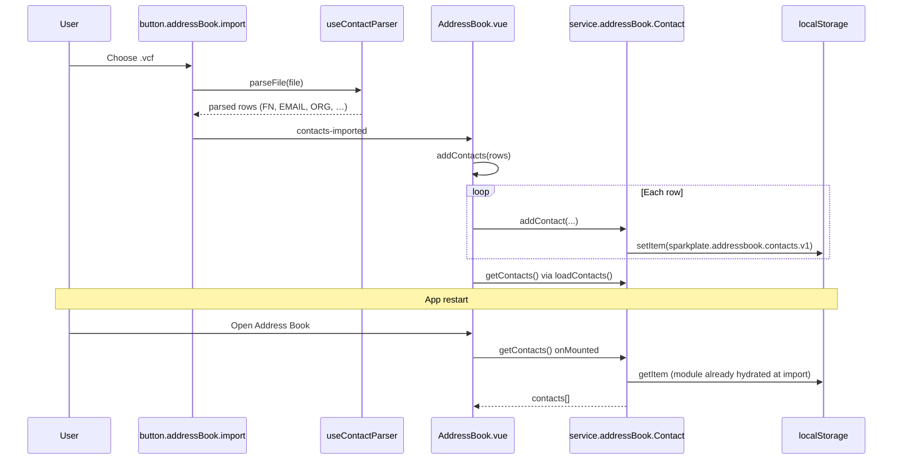

# Address book: pervasive persistence via browser `localStorage` (survives app restart)

**Date:** June 3, 2026 (`06032026`, from `date +%m%d%Y`)  
**Category:** Address book / persistence / state architecture  
**Status:** Documented behavior (by design today, not a bug)

## Observation

On `src/views/AddressBook.vue`, imported data—including contacts from a **vCard** (`.vcf`) file—remains after closing and restarting the Electron (or browser) application. The address book appears “always populated” because nothing in the current stack clears storage on exit; persistence is automatic.

This is expected with the current architecture: the view does **not** hold the canonical copy of contacts in Vue memory alone. It loads from **localStorage-backed services** on mount and writes back on every mutation.

---

## How persistence works (end-to-end)

### Layering

| Layer | Role | Persists? |
|-------|------|-----------|
| **`AddressBook.vue`** | UI state: tabs, search, pagination, selection, modals; calls `loadContacts()` / `addContacts()` | No — in-memory refs only for the session |
| **`src/services/addressBook/*`** | Canonical data + CRUD; module-level arrays + `localStorage.setItem` | **Yes** |
| **`useContactParser` + import button** | Parse files (vCard, CSV, spreadsheet); emit rows to the view | No — transient parse result |
| **`importStandard` / `exportStandard`** | Pure import/export helpers | No |

Greenery’s address book used **Vuex `contacts`** (`contactModule.js`) with `ContactService` and `window.storage` for some export paths. Sparkplate.Fresh has **no Pinia and no Vuex** for this feature today. Persistence lives entirely in the service modules under `src/services/addressBook/`, which matches the “service-backed” direction described in the Vuex→Pinia methodology (see § Relation below).

### Persistence mechanism

Each entity service follows the same pattern:

1. **Hydrate once** when the module is first evaluated in the renderer:
   - `let records = JSON.parse(localStorage.getItem(STORAGE_KEY) || '[]')`
2. **Mutate** the in-memory array on add/update/delete.
3. **Flush** after every mutation:
   - `localStorage.setItem(STORAGE_KEY, JSON.stringify(records))`

In Electron, renderer `localStorage` is tied to the app’s Chromium profile (under user data). It survives process restarts the same way a normal web app’s storage survives browser restarts—there is no separate “session-only” layer unless code explicitly clears keys.

### Storage keys (versioned)

| Service file | `localStorage` key | Contents |
|--------------|-------------------|----------|
| `service.addressBook.Contact.ts` | `sparkplate.addressbook.contacts.v1` | Contact rows (`id`, name, email, company, social fields, …) |
| `service.addressBook.Wallet.ts` | `sparkplate.addressbook.wallets.v1` | Wallets linked to `contactId` |
| `service.addressBook.Exchange.ts` | `sparkplate.addressbook.exchanges.v1` | Standalone exchange records |
| `service.addressBook.StandaloneWallet.ts` | `sparkplate.addressbook.standaloneWallets.v1` | Wallets tab (not tied to a contact) |
| `service.addressBook.Note.ts` | `notes-{ownerId}`, `notes-exchange-{id}`, `notes-company-{id}`, `notes-wallet-{id}` | Per-owner notes |

Companies are **not** stored separately: `service.addressBook.Company.ts` derives companies from contacts that have a non-empty `company` field.

---

## vCard import → restart still populated (concrete path)

**Steps in code:**

1. **Import UI** — `ImportButton` (`button.addressBook.import.vue`) accepts `.vcf,.csv,.ods,.xls,.xlsx` for the Contacts tab.
2. **Parse** — `useContactParser.ts` reads the file as text and scans `BEGIN:VCARD` / `END:VCARD` blocks, mapping `FN:`, `EMAIL:`, `ORG:` into plain objects (minimal vCard subset; not a full vCard library).
3. **Confirm** — `ModalConfirmImportContacts` lets the user confirm; then `contacts-imported` fires.
4. **Persist** — `AddressBook.vue` → `addContacts()` loops `addContact()` in `service.addressBook.Contact.ts`, which appends to the in-memory array and calls `saveContacts()` → `localStorage`.
5. **Optional wallets** — If a parsed row includes a `wallets` string (`coin://address`), the view also calls `addWallet()` → `sparkplate.addressbook.wallets.v1`.
6. **Reload UI** — `loadContacts()` refetches from the service (still the same hydrated module + disk).
7. **Restart** — `onMounted` runs `loadContacts()` again; data is still in `localStorage`, so the table repopulates.

Nothing in `AddressBook.vue` writes contacts only to component `ref`s without going through the service.

---

## What `AddressBook.vue` keeps in memory (non-persistent)

These reset on navigation or full reload of the SPA bundle, but **do not** clear address book data:

- `searchQuery`, `currentPage`, `sortKey`, `sortOrder`, `activeTab`
- Selection arrays (`selectedContacts`, etc.)
- Modal open flags and “draft” selections for edit/details

Canonical lists (`contacts`, `exchanges`, `wallets`) are **reloaded from services** on mount and after mutations; they mirror `localStorage`, not replace it.

---

## Relation to `docs/methodologies/06032026.methodology.vuex.to.pinia.store.conversion.md`

### Current Sparkplate state (methodology §3.1, §3.5)

The methodology states that Sparkplate has **no Pinia today** and that shared state includes **`localStorage`-backed services** in `src/services/addressBook/*`. Address book persistence is an instance of that pattern—not Vuex `vuex-persistedstate` and not SecureLS.

Explicit guidance in **§3.5 Persistence mapping**:

> Keep service-owned data (address book, etc.) in its **existing localStorage services**; do not double-persist.

So a future `useContactsStore` (Phase 2) should **call the same services** (`getContacts`, `addContact`, …) rather than copying contact arrays into a Pinia `persist` plugin with a second key. Double persistence would risk drift between store JSON and service JSON.

### Greenery → Sparkplate mapping (methodology §1.3, §2, §8)

| Greenery | Sparkplate (today) |
|----------|-------------------|
| Vuex **`contacts`** module (`contactModule.js`) — `state.list`, actions `importVcardContact`, `loadContacts`, … | No store — **`AddressBook.vue`** + **`service.addressBook.Contact.ts`** |
| `ContactService` + mutations | Service functions + in-module array + `localStorage` |
| AddressBook view `dispatch('contacts/importVcardContact' \| …)` | `addContacts()` → `addContact()` after `ImportButton` / parser |

**Phase 3** checklist includes “AddressBook (contacts actions)”—meaning migrate **UI wiring** to `useContactsStore()`, not move persistence off `localStorage` unless a separate SQLite migration is chosen (`10192025.methodology.sqlite3.database.implementation.md`).

### Practical implications for Pinia migration

1. **`useContactsStore`** should thinly wrap `src/services/addressBook/*` (load on init, expose list + actions that delegate to service).
2. **Do not** add `persist: { … }` on the Pinia store for contacts if the service already writes `sparkplate.addressbook.contacts.v1`.
3. **vCard import** can stay in `useContactParser` + import button; the store action would be `importRows(rows)` → loop `addContact` in the service (same as `addContacts` today).
4. **Logout / reset** (methodology Phase 5) needs an explicit product decision: Greenery had `resetContactsState`; Sparkplate has no global reset—clearing keys would be a new `clearAddressBook()` API if required.

---

## Clearing or inspecting data (developer)

To verify persistence or reset locally:

- DevTools → Application → Local Storage → origin for the app → delete keys prefixed with `sparkplate.addressbook.` and `notes-`.
- Or programmatically: `localStorage.removeItem('sparkplate.addressbook.contacts.v1')` (and related keys), then reload.

There is no in-app “wipe address book” control documented in the view layer as of this finding.

---

## Related files

| File | Relevance |
|------|-----------|
| `src/views/AddressBook.vue` | Mount load, `addContacts`, import/export handlers |
| `src/services/addressBook/service.addressBook.Contact.ts` | Contact `localStorage` key and CRUD |
| `src/services/addressBook/service.addressBook.Wallet.ts` | Contact-linked wallets |
| `src/composables/useContactParser.ts` | vCard / CSV / spreadsheet parsing |
| `src/components/buttons/addressbook/button.addressBook.import.vue` | File picker + confirm modal |
| `docs/methodologies/06032026.methodology.vuex.to.pinia.store.conversion.md` | Pinia plan; keep service persistence |
| `docs/progress/04282026.progress.addressbook.subsystem.architecture.documentation.md` | Broader subsystem layout |

---

## Summary

Address book data survives restart because **every write goes to `localStorage` through `src/services/addressBook/*`**, not because `AddressBook.vue` retains state across sessions. vCard import is parse → confirm → `addContact` → `localStorage`; reload and restart both read the same keys. The Vuex→Pinia methodology treats this as **service-owned persistence** that should remain the single source of truth when `useContactsStore` is introduced, avoiding duplicate Pinia persistence for the same data.
