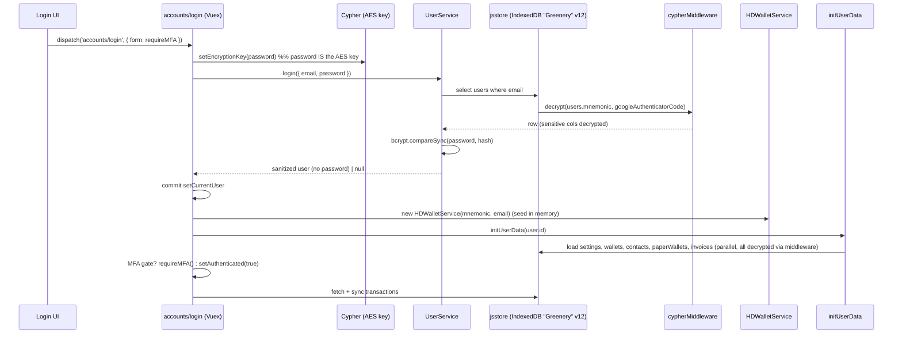

# Greenery login authentication: Vuex + IndexedDB, vs Pinia in Sparkplate, and the IndexedDB → SQLite3 conversion

**Date:** June 10, 2026 (`06102026`, from `date +%m%d%Y`)
**Category:** Authentication / state architecture / database (IndexedDB → SQLite3)
**Status:** Findings + conversion plan (planning artifact)
**Related:** `docs/methodologies/06032026.methodology.vuex.to.pinia.store.conversion.md`, `docs/methodologies/10192025.methodology.sqlite3.database.implementation.md`, `docs/findings/06032026.sparkplate.findings.addressbook.localStorage.persistence.md`

---

## Observation

In **Greenery**, "logging in" is not a single function — it is an orchestration across **three layers**:

1. **Vuex `accounts` module** (`store/accountsModule.js`) — session state + the login/signup/logout/resetPassword actions.
2. **An IndexedDB database** (`Greenery`, **v12**) accessed through **jsstore** (`service/IdbService.js`) with a transparent **encryption middleware** (`service/middleware/cypherMiddleware.js`).
3. **Crypto/identity services** — `UserService` (bcrypt + CRUD), `Cypher` (AES, keyed on the password), `HDWalletService` (mnemonic/seed custody), `MultiFAService` (TOTP).

**Sparkplate.Fresh** has already completed *Phase 1* of the Vuex→Pinia migration: `src/stores/useAccountsStore.ts` (Pinia setup store) + `src/composables/useAuth.ts` (shim) + `src/services/account/service.account.User.ts` (localStorage + PBKDF2). But it has **no database** (no IndexedDB, no SQLite), **no encryption-at-rest middleware**, and **none** of the wallet/MFA/login-orchestration layers. This document maps every Greenery auth area, compares it to the Pinia world, explains where the database comes into play, and specifies how to implement SQLite3 in place of IndexedDB.

---

## 1. How login auth works in Greenery (end-to-end)

### 1.1 The login sequence



The critical, non-obvious design point: **the user's password is the AES encryption key**. `cypher.setEncryptionKey(password)` is called *before* any read, so every subsequent decrypt of sensitive columns (mnemonic, private keys, exchange secrets) only succeeds with the correct password. Authentication (bcrypt) and decryption (AES) are coupled through the same secret.

### 1.2 Areas in Greenery that use Vuex + IndexedDB for login auth

| Area / file | Vuex role | IndexedDB / DB role | Notes for migration |
|-------------|-----------|---------------------|---------------------|
| `store/accountsModule.js` | `state.active/all/status/hdWallet/authenticated/ip`; actions `signup`, `login`, `setAuthenticated`, `logout`, `updateUser`, `resetPassword`, `initUserData`, `fetchIP`, `loadAccounts` | indirectly via `UserService` | The orchestrator. Maps to `useAccountsStore`. |
| `service/IdbService.js` | — | Creates jsstore `Connection` over a Web Worker; DB `Greenery` **v12**; `initJsStore`, `initDatabase`, `performDatabaseUpdate` (migrations in +1 steps), registers `cypherMiddleware` | The whole DB engine. Replace with SQLite `DatabaseService` + `MigrationManager`. |
| `service/UserService.js` | called by `accounts` actions | `users` table CRUD; `bcrypt.hashSync`(10) on insert; `bcrypt.compareSync` on `login`; `sanitize()` strips `password`; sets `localStorage.authenticated` | Sparkplate has a near-equivalent (`service.account.User.ts`) but **PBKDF2, not bcrypt**, and **localStorage, not a DB**. |
| `service/tables/users.js` | — | jsstore schema: `id` PK autoinc, `email`, `password`, `mnemonic`(enc), `googleAuthenticatorCode`(enc), profile fields, per-exchange API key columns, `login_history` Array | Becomes a SQL `CREATE TABLE users` (see §4.2). |
| `service/Cypher.js` | key set in `login`/`signup`/`resetPassword` | AES via crypto-js; `key` = password; `updateEncryptionKey` re-encrypts **all** user rows on password change | No Sparkplate equivalent. Field encryption is entirely missing. |
| `service/middleware/cypherMiddleware.js` | — | Transparent encrypt-on-write / decrypt-on-read for `cypherParams` columns; `bypassCypherMiddleware` flag | No SQLite middleware exists; must be re-created in the service layer or via SQLCipher (see §5). |
| `service/HDWalletService.js` | `commit('setHDWallet')` in `login`/`signup` | reads `mnemonic` from decrypted user row; derivation counters in `localStorage`; `generateUserSteg` via `window.ipcRenderer.invoke('createUserSteg')` | Wallet/seed custody — entirely missing in Sparkplate (Phase 4). |
| `service/MultiFAService.js` | `requireMFA()` gate in `login` | reads `googleAuthenticatorCode` (decrypted); TOTP via `window.authenticator`; QR via `qrcode` | MFA — entirely missing in Sparkplate. |
| `store/settingsModule.js`, `walletModule.js`, `contactModule.js`, `paperWalletModule.js`, `invoicesModule.js`, `activityModule.js` | loaded by `initUserData` after login | each backed by its own jsstore table + service | Login is the trigger for hydrating the whole app; Sparkplate has no such orchestration. |

### 1.3 The other auth actions (often missed)

- **`signup`** — `setEncryptionKey(password)` → build `HDWalletService` → `fetchIP()` → `window.geoip.lookup(ip)` → derive country/currency (`country-state-city`, `country-currency-map`) → `userService.addUser` (bcrypt) → `generateUserSteg` → `createUserSettings` → `setAuthenticated(true)` → optional `generateInitialWallets`.
- **`setAuthenticated`** — flips the flag *and* notifies Electron main: `window.ipcRenderer.send('setBugTracking', …)` and `('setAppCloseToTray', …)`.
- **`logout`** — logs a `logout` activity, then **cascades `reset*State` across every module** (`accounts`, `userSettings`, `wallets`, `contacts`, `activities`, `invoices`, `transactions`, `paperWallet`) + `web3Connections/performLogout`. This is how Greenery guarantees no decrypted data survives a logout.
- **`resetPassword`** — `cypher.updateEncryptionKey({ key, userId })` **re-encrypts every sensitive row** with the new password-derived key, then `updateUserPassword` (new bcrypt hash) and a fresh `HDWalletService` + steg. Password change is a full re-encryption event, not just a hash swap.

### 1.4 Encryption scope (`cypherParams`)

| Table | Encrypted columns |
|-------|-------------------|
| `users` | `googleAuthenticatorCode`, `mnemonic` |
| `wallets` | `wif`, `privateKey` |
| `paperWallets` | `privateKey` |
| `userSettings` | `emailConfigPassword`, `exchanges` (nested per-exchange `apiKey/apiSecret/apiPhrase`) |
| `mnemonicPasswords` | `mpPrivateKey` |

`password` itself is **not** in `cypherParams` — it is bcrypt-hashed by `UserService`, not AES-encrypted. Everything else sensitive is AES-encrypted at rest, keyed on the (unstored) password.

---

## 2. Greenery (Vuex + IndexedDB) vs Sparkplate (Pinia)

### 2.1 State management

| Concern | Greenery (Vuex) | Sparkplate (Pinia, today) |
|---------|-----------------|---------------------------|
| Session store | `accounts` Vuex module (namespaced) | `useAccountsStore` (setup store) + `useAuth` shim |
| Active user | `state.active` (full row incl. mnemonic in memory) | `active` ref (`User` = id/name/email only) |
| Auth flag | `state.authenticated` | `authenticated` ref |
| All users | `state.all` | `all` ref (via `listUsers()`) |
| Login | `dispatch('accounts/login', …)` (orchestrates DB + HD + MFA + init) | `store.authenticate(email, password)` → `verifyLogin` only |
| Signup | `dispatch('accounts/signup', …)` (geoip, steg, settings, wallets) | `store.signup(input)` → `createUser` only |
| Logout cascade | resets 8 modules + web3 | `logout()` clears only the accounts refs |
| Persistence of session | **not persisted** (reload ⇒ re-login) | **not persisted** (parity — by design) |
| Mutations | explicit `commit` | folded into actions (mutate `.value`) |

### 2.2 Database / persistence

| Concern | Greenery | Sparkplate (today) |
|---------|----------|--------------------|
| Engine | **IndexedDB** via **jsstore** (Web Worker, renderer) | **`localStorage`** only |
| Auth store of record | `users` table in `Greenery` v12 DB | `sparkplate.accounts.users.v1` localStorage key |
| Password hashing | `bcryptjs` (rounds 10) | `crypto-js` **PBKDF2** (SHA-256, 100k iters, per-user salt) + constant-time compare |
| Encryption at rest | AES field encryption via `cypherMiddleware`, keyed on password | **none** (only the password is hashed; profile fields are plaintext) |
| Schema/migrations | `tables/*.js` + `dbVersion` + `performDatabaseUpdate` | none (implicit JSON shape) |
| Query model | jsstore proprietary API (`select/insert/update/remove/count/clear`) | array `.find/.filter/.map` |
| Where it runs | renderer (worker) | renderer |

### 2.3 Why this matters

Sparkplate's `service.account.User.ts` is a faithful *shape* match of `UserService` (unique email, hash, sanitize to a credential-free `PublicUser`, never expose the hash to the store/UI). But it stops at **authentication**. Greenery's login is also the moment the app **unlocks encrypted data** and **hydrates every feature store**. Sparkplate currently has neither the encrypted data nor the database to hold it.

---

## 3. Where the database comes into play

The database is touched at five auth moments. Each is a place Sparkplate must grow a DB call.

1. **Signup** — `INSERT` a new `users` row (bcrypt hash; mnemonic + 2FA secret AES-encrypted), plus the initial `user_settings` row.
2. **Login** — `SELECT` the user by email (middleware decrypts mnemonic/2FA), bcrypt-compare, then bulk `SELECT` settings/wallets/contacts/paperWallets/invoices/transactions.
3. **MFA gate** — read the decrypted `googleAuthenticatorCode` to verify a TOTP token.
4. **Profile update / password reset** — `UPDATE users`; on password change, **re-encrypt all sensitive rows** with the new key.
5. **Logout** — no DB write beyond an activity-log `INSERT`; the security boundary is in-memory state reset, since data on disk stays encrypted.

In Sparkplate today only #1, #2 (auth-only), and #4 (profile, unencrypted) exist, and they hit `localStorage`, not a database.

---

## 4. Implementing SQLite3, converting from IndexedDB

Target: replace jsstore (IndexedDB, renderer) with **`better-sqlite3`** (main process) exposed to the renderer over IPC, per `10192025.methodology.sqlite3.database.implementation.md`. This also satisfies the Vuex→Pinia methodology's **§5 Electron boundary** (the store must not assume a renderer DB).

### 4.1 Concept mapping (jsstore → better-sqlite3)

| jsstore / IndexedDB (Greenery) | better-sqlite3 / SQLite (Sparkplate) |
|--------------------------------|--------------------------------------|
| `new Connection(new JsStoreWorker())` in renderer | `new Database(path)` singleton in **main process** (`DatabaseService`) |
| `idbCon.initDb(getDatabase())` with `tables/*.js` | `CREATE TABLE` statements run at init |
| `dbVersion = 12` + `performDatabaseUpdate` (+1 steps, data transforms at v3/6/8/9/10) | `migrations` table + `MigrationManager` (versioned, transactional) |
| `DATA_TYPE.String` | `TEXT` |
| `DATA_TYPE.Number` | `INTEGER` / `REAL` |
| `DATA_TYPE.Boolean` | `INTEGER` (0/1) |
| `DATA_TYPE.Array` / nested objects (`login_history`, `exchanges`) | `TEXT` holding JSON (`JSON.stringify` on write, parse on read) |
| `idbCon.select({ from, where })` | `db.prepare('SELECT … WHERE …').all(params)` |
| `idbCon.insert({ into, values, return:true })` | `db.prepare('INSERT … RETURNING *').get(params)` |
| `idbCon.update({ in, set, where })` | `db.prepare('UPDATE … SET … WHERE …').run(params)` |
| `idbCon.count({ from, where })` | `SELECT COUNT(*)` |
| `idbCon.remove` / `clear` | `DELETE FROM …` |
| `cypherMiddleware` (auto encrypt/decrypt) | explicit encrypt/decrypt in the service layer, or **SQLCipher** (see §5) |
| `bypassCypherMiddleware: true` | just don't call the encrypt helper for that write |
| renderer calls `idbCon.*` directly | renderer → `window.database.*` (IPC `invoke`) → main `ipcMain.handle` |

### 4.2 `users` table (jsstore schema → SQL)

```sql
CREATE TABLE IF NOT EXISTS users (
  id            INTEGER PRIMARY KEY AUTOINCREMENT,
  email         TEXT    NOT NULL UNIQUE,
  password      TEXT    NOT NULL,         -- bcrypt hash
  mnemonic      TEXT    NOT NULL,         -- AES-encrypted (was cypherParams.users)
  firstname     TEXT    NOT NULL,
  lastname      TEXT    NOT NULL,
  company       TEXT,
  address       TEXT,
  country       TEXT,
  stateProvince TEXT,
  city          TEXT,
  zip           TEXT,
  timezone      TEXT,
  currency      TEXT,
  globalCurrency TEXT,
  website       TEXT,
  twitter       TEXT,
  instagram     TEXT,
  phone         TEXT,
  signatureStyle TEXT,
  addressBookToggle      INTEGER DEFAULT 1,
  annotationsToggle      INTEGER DEFAULT 1,
  prefixedAddressesToggle INTEGER DEFAULT 0,
  emailAccompanyToggle   INTEGER DEFAULT 0,
  userProfileType        TEXT,
  companyTypeIndex       INTEGER,
  googleAuthenticatorCode TEXT,           -- AES-encrypted (2FA secret)
  login_history TEXT DEFAULT '[]'         -- JSON array
);
CREATE INDEX IF NOT EXISTS idx_users_email ON users(email);
```

(The per-exchange API key columns from `tables/users.js` — `binanceApiKey`, etc. — were already superseded in Greenery by the `userSettings.exchanges` JSON blob; carry them into `user_settings` as a JSON column rather than reproducing ~30 columns.)

### 4.3 Service + IPC shape

- **Main**: `DatabaseService` (singleton, `journal_mode = WAL`), `UserService.ts` (`getUserByEmail`, `addUser`, `verifyLogin`, `updateUserById`, `updateUserPassword`, `sanitize`), `MigrationManager`.
- **Preload**: `contextBridge.exposeInMainWorld('database', { user: { create, get, login, update, … }, settings: { … } })`.
- **Renderer**: `service.account.User.ts` swaps its `localStorage` body for `window.database.user.*` calls; **`useAccountsStore` does not change** (it already calls the service, not storage directly) — this is the payoff of the methodology's "service-owned persistence" rule.

### 4.4 Data migration (existing installs)

Greenery shipped IndexedDB; a fresh Sparkplate has only `localStorage`. Provide a one-time `IdbToSqliteMigration` (methodology §"Migration from IndexedDB"): open the old `Greenery` DB (or read the localStorage users key), transform rows to the SQL schema, `INSERT`, verify counts, then mark migrated. Because sensitive columns were AES-encrypted with the password, migration of encrypted fields can only happen **at the user's next login** (when the key is available) — migrate plaintext/profile fields eagerly, sensitive fields lazily on first authenticated session.

---

## 5. Encryption-at-rest: replacing `cypherMiddleware`

jsstore let Greenery hook a middleware onto every query. better-sqlite3 has no equivalent hook, so choose one:

| Option | How | Trade-off |
|--------|-----|-----------|
| **A. Service-layer field encryption** (closest to Greenery) | Re-create `cypherParams` as a map in the SQLite `UserService`; AES-encrypt listed columns before `INSERT/UPDATE`, decrypt after `SELECT`, keyed on the password (held in main-process memory for the session) | Faithful to Greenery; selective; must thread the key to main process securely |
| **B. SQLCipher (whole-file encryption)** | Use `better-sqlite3-multiple-ciphers` / SQLCipher; `PRAGMA key` = key derived from password at login | Simplest; encrypts everything; whole DB locked behind one key, so multi-user-on-one-machine needs care |
| **C. App-level + hashed password (current Sparkplate)** | Keep PBKDF2 password hashing, leave other fields plaintext | **Not up to par** — no at-rest protection for seeds/secrets |

Recommendation: **A** for parity (matches `cypherParams` exactly and the password-as-key model), or **B** if a single encrypted DB file is acceptable and simpler to operate. Either way, decide how the password-derived key reaches the main process (e.g. pass at `db:user:login`, hold in a main-process session object, drop on logout).

---

## 6. What is missing in Sparkplate to reach parity

Ordered roughly by dependency. Items 1–3 are prerequisites for a real wallet app; 4–8 complete auth parity.

| # | Missing capability | Greenery source | Sparkplate gap | Suggested home |
|---|--------------------|-----------------|----------------|----------------|
| 1 | **A database** (SQLite via IPC) | `IdbService.js` (jsstore) | only `localStorage` | `background/main` `DatabaseService` + `window.database` (methodology `10192025…`) |
| 2 | **Encryption at rest** keyed on password | `Cypher.js` + `cypherMiddleware.js` + `cypherParams` | none | §5 Option A or B |
| 3 | **Schema + migrations** | `tables/*.js`, `dbVersion`, `performDatabaseUpdate` | none | `MigrationManager` + SQL DDL (§4.2) |
| 4 | **HD wallet / seed custody at login** | `HDWalletService` (+ `window.cryptos`, `createUserSteg`) | none | Phase 4 store + IPC crypto bridge |
| 5 | **MFA / TOTP gate** | `MultiFAService` (`window.authenticator`) | none | `useMfa` + main-process TOTP handler |
| 6 | **Login orchestration** (`initUserData`) | `accounts/login` → loads settings/wallets/contacts/paperWallets/invoices/transactions | `authenticate()` verifies only | extend `useAccountsStore.authenticate` to hydrate other stores |
| 7 | **Logout cascade reset** across stores | `accounts/logout` resets 8 modules + web3 | `logout()` clears accounts only | central `resetAllStores()` calling each store's `$reset()`/`reset()` |
| 8 | **Password reset = full re-encryption** | `resetPassword` → `cypher.updateEncryptionKey` | none | service method re-encrypting all rows under the new key |
| — | **bcrypt vs PBKDF2** decision | `bcryptjs` | PBKDF2 (`crypto-js`) | methodology `10192025…` specifies `bcryptjs`; either standardize on bcrypt or document PBKDF2 as the intentional V2 choice |
| — | **IP/geoip + login_history + activity log** | `fetchIP`, `window.geoip`, `addLoginActivity` | none | optional; needs IPC + an `activities` store/table |
| — | **Electron `setBugTracking`/`setAppCloseToTray`** on auth | `accounts/setAuthenticated` | not wired to auth | hook into post-login once settings store exists |

### What is already in place (don't rebuild)

- Pinia + `useAccountsStore` session store with `active/all/authenticated`, `login/logout/signup/authenticate/loadUsers/reset`, `user/loggedIn` getters.
- `useAuth` shim preserving the original return shape for existing consumers.
- `service.account.User.ts`: unique-email enforcement, salted password hashing, constant-time compare, `sanitize → PublicUser`, never exposing the hash to store/UI.
- The "service-owned persistence" boundary, which means swapping `localStorage` for SQLite is a **service-only** change — the store and UI stay untouched.

---

## 7. Recommended sequence

1. **DB foundation** — install `better-sqlite3` (+ `bcryptjs` if standardizing on bcrypt); build `DatabaseService` + `users`/`user_settings`/`migrations` tables + `MigrationManager`; expose `window.database` (methodology `10192025…` Phases 1–3, 6).
2. **Repoint the service** — change `service.account.User.ts` internals from `localStorage` to `window.database.user.*`. No store/UI change. Add the lazy localStorage→SQLite import.
3. **Encryption at rest** — implement §5 (A or B); reintroduce `cypherParams` columns (`mnemonic`, `googleAuthenticatorCode` first).
4. **Login orchestration + logout cascade** — extend `authenticate()` to hydrate other stores; add `resetAllStores()` to `logout()`.
5. **Wallet/MFA (Phase 4)** — HD seed custody, TOTP, password-reset re-encryption, IP/activity logging.

---

## 8. Related files

| File | Relevance |
|------|-----------|
| `greenery/src/store/accountsModule.js` | Vuex login/signup/logout/resetPassword orchestration |
| `greenery/src/service/IdbService.js` | jsstore IndexedDB engine + migrations + middleware registration |
| `greenery/src/service/UserService.js` | bcrypt CRUD + `login`/`sanitize` |
| `greenery/src/service/Cypher.js`, `service/middleware/cypherMiddleware.js` | password-keyed AES field encryption |
| `greenery/src/service/tables/users.js` | `users` schema → SQL (§4.2) |
| `greenery/src/service/HDWalletService.js`, `MultiFAService.js` | seed custody + TOTP (missing in Sparkplate) |
| `Sparkplate.Fresh/src/stores/useAccountsStore.ts` | current Pinia session store |
| `Sparkplate.Fresh/src/composables/useAuth.ts` | shim over the store |
| `Sparkplate.Fresh/src/services/account/service.account.User.ts` | localStorage + PBKDF2 user service (DB swap target) |
| `docs/methodologies/10192025.methodology.sqlite3.database.implementation.md` | SQLite engine + IPC + migration plan |
| `docs/methodologies/06032026.methodology.vuex.to.pinia.store.conversion.md` | Pinia migration + Electron boundary + service-owned persistence |

---

## Summary

Greenery login is a three-layer system: a Vuex `accounts` module that orchestrates the flow, an **IndexedDB (jsstore) `Greenery` v12** database with **transparent password-keyed AES field encryption** (`cypherMiddleware`), and identity services (`UserService`/bcrypt, `Cypher`, `HDWalletService`, `MultiFAService`). The defining idea is that **the password is both the auth secret (bcrypt) and the AES key (Cypher)**, so login simultaneously authenticates and unlocks encrypted data, then hydrates every feature store via `initUserData`; logout resets all of it in memory.

Sparkplate already has the Pinia half (`useAccountsStore` + `useAuth` + a PBKDF2 `service.account.User.ts`), but stores accounts in **`localStorage` with no at-rest encryption and no database**, and lacks the wallet/MFA/orchestration layers. Reaching parity means: stand up **SQLite (`better-sqlite3`) in the main process behind `window.database`**, map the jsstore schema/queries/migrations to SQL (§4), re-create `cypherMiddleware` as service-layer field encryption or SQLCipher (§5), and then add login orchestration, logout cascade, MFA, and HD-wallet custody (§6). Because persistence is service-owned, the database swap is a **service-only change** — the Pinia store and UI stay as-is.
