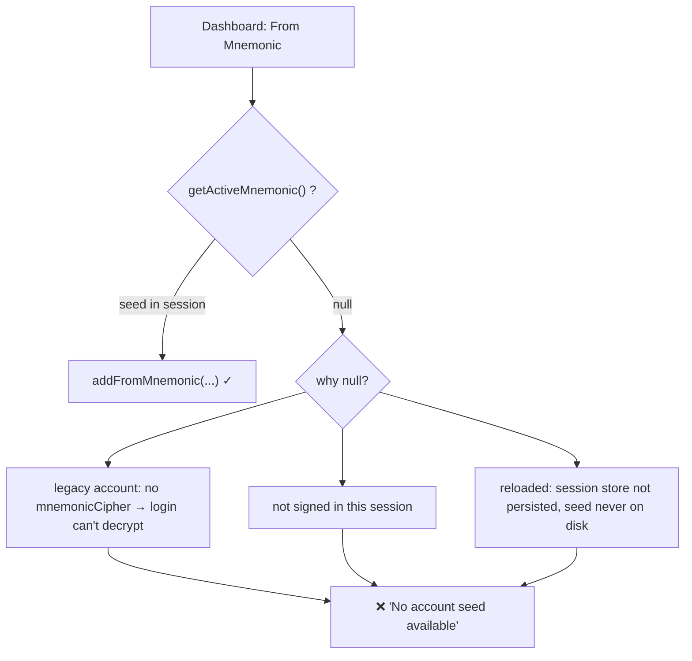
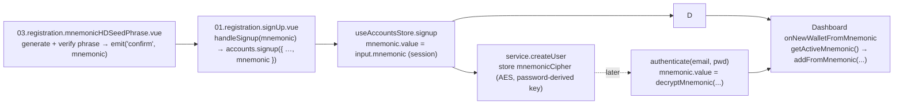

# "No account seed available": why HD wallet generation fails and how it's fixed

**Date:** June 12, 2026 (`06122026`, from `date +%m%d%Y`)
**Category:** Dashboard / HD wallet generation / account seed custody (session)
**Status:** Findings + fix (implemented)
**Related:** `docs/findings/20260612.findings.dashboard.wallet.address.generation.discarded.registration.mnemonic.md`, `docs/findings/06122026.sparkplate.findings.dashboard.wallet.address.generation.md`, `docs/findings/06102026.sparkplate.findings.greenery.login.auth.vuex.indexeddb.to.sqlite3.md`

---

## Symptom

Clicking **New Wallet → From Mnemonic** on the Dashboard raises:

> No account seed available. Please sign in again to derive HD wallets.

The address is never generated.

---

## Root cause

The discarded-registration-mnemonic fix made "From Mnemonic" derive from the **active account's seed phrase** instead of a throwaway. The Dashboard reads that seed via `useAccountsStore.getActiveMnemonic()`, which returns the store's **in-memory** `mnemonic` ref. That ref is the source of HD derivation — and it is `null` unless one of two things populated it:

```ts
// useAccountsStore.ts
const mnemonic = ref<string | null>(null)

async function signup(input) {            // (a) set at registration
  …
  mnemonic.value = input.mnemonic?.trim() || null
}

async function authenticate(email, password) {  // (b) restored at login (decrypt)
  …
  mnemonic.value = await decryptMnemonic(email, password)
}

function getActiveMnemonic() { return mnemonic.value }
```

So `getActiveMnemonic()` is `null` — and the Dashboard throws — in every case where neither path ran with a real seed:

1. **Legacy / pre-existing account (the common case).** The account was created **before** encrypted seed custody existed, so its service record has **no `mnemonicCipher`**. At login, `decryptMnemonic` finds nothing to decrypt and returns `null`. The account simply has no seed on file.
2. **Not signed in.** The New Wallet button is gated only on an active *currency*, not on auth. A user who never authenticated this session has `mnemonic === null`.
3. **After an app reload.** `useAccountsStore` is intentionally **not persisted** (`persist` is disabled), and the decrypted seed is deliberately **never written to disk** (writing a plaintext seed to `localStorage` would be a security regression). After a reload the session — including the seed — is gone until the user re-authenticates, which re-runs path (b).
4. **A new account in a session that signed up before the forwarding fix** (stale dev state).

In short: the derivation logic is correct, but for these sessions there is **no seed in memory to derive from**, so the guard fires.



### Why not just persist the seed across reloads?

Because the only safe at-rest copy is the **password-encrypted** `mnemonicCipher` owned by the account service; the *plaintext* session seed must never be persisted. Restoring it after a reload therefore requires the password again (re-authentication), by design. That keeps the threat model intact but means a fresh session legitimately starts with `mnemonic === null`.

---

## Fix

**Design decision:** generated wallets must derive **only** from the account's registration seed — the BIP-39 phrase produced + verified in `03.registration.mnemonicHDSeedPhrase.vue`. There is **no** manual phrase-entry path on the Dashboard (an earlier `window.prompt` / modal fallback was removed): allowing arbitrary phrase entry would let a user derive addresses unrelated to their account seed, which is exactly the non-determinism this whole effort set out to eliminate.

So the seed reaches the Dashboard through one chain only:



### Dashboard behavior — `src/views/Dashboard.vue`

`onNewWalletFromMnemonic` derives from `accountsStore.getActiveMnemonic()` and nothing else. When the session has no seed it stops with a clear, actionable message rather than accepting an unrelated phrase:

```ts
const mnemonic = accountsStore.getActiveMnemonic()
if (!mnemonic) {
  throw new Error(
    'No account seed available. Please sign in to the account whose recovery phrase you set at registration.',
  )
}
await walletsStore.addFromMnemonic(activeTicker.value, mnemonic, {
  isHDWallet: true,
  index: nextHdIndex(activeTicker.value),
})
```

### Net effect

- **New accounts** (registered after the seed-custody fix): seed is set at signup → "From Mnemonic" derives immediately from the registration phrase.
- **Returning accounts with a stored seed**: seed decrypted at login → derives immediately.
- **Legacy accounts (created before seed custody) / not-signed-in / reloaded-without-relogin**: no seed is on the account record (or it isn't decrypted yet), so the action stops with the sign-in message. The only way to obtain a seed is to **register** (which now persists it) or **sign in** to an account that has one — never by typing a phrase into the Dashboard.

---

## Verifying the fix

1. **Register a new account.** On the mnemonic step, save the recovery phrase shown and complete signup.
2. Open the Dashboard, select a supported currency (BTC, LTC, DOGE, ETH, SOL), and click **New Wallet → From Mnemonic**.
3. A deterministic address appears and is persisted. Clicking again yields the **next** HD index.
4. **Sign out and back in** to the same account → "From Mnemonic" still works (the seed is decrypted from `mnemonicCipher` at login) and continues the index progression.
5. With a **legacy / no-seed** account (or while signed out), the action shows the "sign in to the account whose recovery phrase you set at registration" message and generates nothing.

---

## Follow-ups

- **Migrate legacy accounts.** Accounts created before seed custody have no `mnemonicCipher` and therefore cannot generate HD wallets until they re-establish a seed. Provide a guided "set / re-enter your recovery phrase" flow **in account settings** (gated by the account password so it can be encrypted to `mnemonicCipher`), not on the Dashboard — keeping the Dashboard strictly a consumer of the account seed.
- **Gate New Wallet on authentication** if HD generation should be sign-in-only.

---

## Related files

| File | Role |
|------|------|
| `src/components/authentication/registration/03.registration.mnemonicHDSeedPhrase.vue` | Generates + verifies the recovery phrase; emits `confirm(mnemonic)` — the sole seed source |
| `src/components/authentication/registration/01.registration.signUp.vue` | forwards the registration phrase into `signup` |
| `src/stores/useAccountsStore.ts` | `mnemonic` session ref, `getActiveMnemonic` (set at signup, decrypted at login) |
| `src/services/account/service.account.User.ts` | encrypted `mnemonicCipher` + `decryptMnemonic` (login restore) |
| `src/views/Dashboard.vue` | `onNewWalletFromMnemonic` derives from the account seed only |
| `docs/findings/20260612.findings.dashboard.wallet.address.generation.discarded.registration.mnemonic.md` | root-cause of the original discarded-seed defect |
