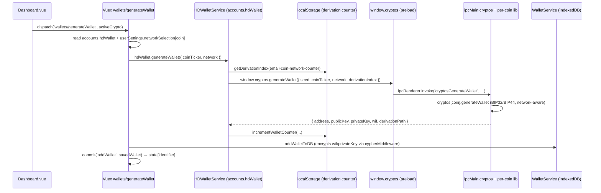
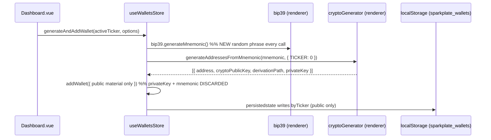

# Dashboard wallet-address generation: Greenery vs Sparkplate, and what's missing for proper generation

**Date:** June 12, 2026 (`06122026`, from `date +%m%d%Y`)
**Category:** Dashboard / wallet generation / HD derivation / Electron crypto bridge
**Status:** Findings + gap analysis (planning artifact)
**Related:** `docs/methodologies/06032026.methodology.vuex.to.pinia.store.conversion.md`, `docs/findings/06102026.sparkplate.findings.greenery.login.auth.vuex.indexeddb.to.sqlite3.md`, `docs/methodologies/10192025.methodology.sqlite3.database.implementation.md`

---

## Observation

Both Dashboards expose the same UI affordance — a **New Wallet** dropdown ("From Mnemonic" / "Throwaway") and an empty-state **Generate Wallet** button — but the machinery behind the button is fundamentally different.

- **Greenery** derives every address from **one persistent per-user HD seed** established at login, runs the cryptography in the **Electron main process** (`window.cryptos`), uses an **incrementing derivation index** so each click yields the *next deterministic* address, applies the user's **network selection** (mainnet/testnet), and **persists the secret material** (encrypted) so wallets are spendable and recoverable.
- **Sparkplate** already establishes a real BIP-39 recovery phrase during registration (`03.registration.mnemonicHDSeedPhrase.vue` — generated, verified, and printable), but that phrase is **discarded at signup** (`01.registration.signUp.vue` `handleSignup` ignores it) and never reaches the account or the wallet store. The Dashboard therefore mints a **brand-new random mnemonic on every click**, derives the address **in the renderer** (`@/utils/cryptoGenerator`) at **index 0 on mainnet**, then **discards the seed/private key**, persisting only the public address — so generated addresses are unrelated to the user's recovery phrase and are unrecoverable. See the root-cause finding `20260612.findings.dashboard.wallet.address.generation.discarded.registration.mnemonic.md`.

The net effect: Sparkplate's Dashboard produces *display-only* public addresses that **cannot be spent, recovered, or re-derived**, "From Mnemonic" and "Throwaway" behave identically, and several coins produce **non-standard (invalid) addresses**. This document traces both flows and enumerates what Sparkplate's Dashboard needs to generate addresses properly.

---

## 1. How Greenery generates wallet addresses

### 1.1 Flow



### 1.2 Key properties (from source)

- **Single master seed per user.** `accounts.hdWallet` is an `HDWalletService` built at login from the account's mnemonic (decrypted from IndexedDB with the password). Every coin address derives from `this.seed`.
- **Dashboard entry point** — `createWallet()` dispatches the store action:

```681:694:greenery/src/views/Dashboard.vue
    async createWallet() {
      try {
        this.showLoader()
        await this.$store.dispatch(
          'wallets/generateWallet',
          this.activeCrypto.toLowerCase()
        )
      } catch (err) {
```

- **Store action reads seed + network, delegates to the HD service:**

```130:147:greenery/src/store/walletModule.js
    async generateWallet({ commit, rootState, dispatch }, blockchain) {
      const { hdWallet } = rootState.accounts
      const network =
        rootState.userSettings.networkSelection[blockchain.toLowerCase()]
      const wallet = await hdWallet.generateWallet({
        coinTicker: blockchain,
        network
      })
```

- **Deterministic, indexed derivation** — `HDWalletService` computes a per-`email-coin-network` counter from `localStorage`, calls into the main process, then **increments** the counter so the next click yields the next address:

```15:32:greenery/src/service/HDWalletService.js
  async generateWallet({ coinTicker, network, displacer = 0 }) {
    const seed = this.seed
    const derivationIndex =
      displacer || this.getDerivationIndex({ coinTicker, network })
    const wallet = await window.cryptos.generateWallet({
      seed,
      coinTicker,
      network,
      derivationIndex
    })
    if (!displacer) this.incrementWalletCounter({ coinTicker, network })
```

- **Cryptography runs in the Electron main process**, per-coin, network-aware (mainnet vs testnet derivation paths + network params), returning the full key material:

```14:42:greenery/background/utils/cryptos/btc.js
  generateWallet({ seed, derivationIndex, network }) {
    const isMainnet = network === 'bitcoin'
    const derivationPath = !isMainnet
      ? "m/44'/1'/0'/0/" + derivationIndex
      : "m/44'/0'/0'/0/" + derivationIndex
    const bitcoinNetwork = isMainnet
      ? bitcoin.networks.mainnet
      : bitcoin.networks.testnet
    const hdMaster = bitcoin.bip32.fromSeed(Buffer.from(seed), bitcoinNetwork)
    const key = hdMaster.derivePath(derivationPath)
    const address = bitcoin.payments.p2pkh({ pubkey: key.publicKey, network: bitcoinNetwork }).address
    const wallet = { privateKey: …, publicKey: …, wif: key.toWIF(), address, derivationPath }
    return wallet
  },
```

- **Secrets persisted (encrypted).** `addWalletToDB` stores `wif`/`privateKey` to IndexedDB, where `cypherMiddleware` AES-encrypts them (keyed on the password) — so wallets are recoverable and spendable.
- **Two distinct paths.** "From Mnemonic" → HD `generateWallet` (deterministic, from the user seed). "Throwaway" → `generateBasicWallet` → `window.cryptos.generateBasicWallet` (a random keypair, not HD). They produce *different* kinds of wallets.
- **Guardrails** — max 5 HD wallets per coin (`initCreateWallet`); token coins link to an existing blockchain wallet instead of deriving.
- **Balances/sending** also go through `window.cryptos` (`getBalances`, `sendToAddress`).

---

## 2. How Sparkplate generates wallet addresses

### 2.1 Flow



### 2.2 Key properties (from source)

- **Dashboard entry point** — both dropdown actions call the same `generateWallet`, which calls the store; **neither passes a real mnemonic**:

```415:433:Sparkplate.Fresh/src/views/Dashboard.vue
async function generateWallet(options: { isHDWallet: boolean; nickname?: string }): Promise<void> {
  if (!activeTicker.value || walletBusy.value) return
  walletBusy.value = true
  try {
    await walletsStore.generateAndAddWallet(activeTicker.value, options)
  …
}
function onNewWalletFromMnemonic(): void { void generateWallet({ isHDWallet: true }) }
function onNewWalletThrowaway(): void { void generateWallet({ isHDWallet: false, nickname: 'Throwaway' }) }
```

- **A fresh random mnemonic is minted and discarded on every generation:**

```162:170:Sparkplate.Fresh/src/stores/useWalletsStore.ts
    async function generateAndAddWallet(
      ticker: string,
      options: GenerateWalletOptions = {},
    ): Promise<StoredWallet | null> {
      const bip39 = await import('bip39')
      const mnemonic = bip39.generateMnemonic()
      return addFromMnemonic(ticker, mnemonic, options)
    }
```

- **Derivation runs in the renderer**, always index 0, then only the **public** parts are kept:

```129:156:Sparkplate.Fresh/src/stores/useWalletsStore.ts
    async function addFromMnemonic(ticker, mnemonic, options = {}) {
      const key = ticker.toUpperCase()
      const index = options.index ?? 0
      const { generateAddressesFromMnemonic } = await import('@/utils/cryptoGenerator')
      const derived = await generateAddressesFromMnemonic(mnemonic, { [key]: index })
      const match = derived.find((d) => d.currency.toUpperCase() === key)
      if (!match || !match.address) { throw new Error(`Generating a ${key} wallet … is not supported …`) }
      return addWallet({ ticker: key, address: match.address, publicKey: match.cryptoPublicKey,
        derivationPath: match.derivationPath, isHDWallet: options.isHDWallet ?? true, … balance: 0 })
    }
```

- **Persistence is public-only** (`pinia-plugin-persistedstate`, key `sparkplate_wallets`, `pick: ['byTicker']`); no private key, WIF, or mnemonic is stored anywhere.
- **`cryptoGenerator` supports** BTC, LTC, DOGE, ETH, TRX, SOL, XTZ, LUNC. BTC/LTC/DOGE/ETH/SOL use standard libraries; **TRX, XTZ, LUNC use "simplified" address construction** (e.g. `"T" + bs58(...)`, `"tz1" + bs58(...)`, `"terra1" + bs58(...)`) that are **not valid network addresses**.
- **No network selection** — derivation is hardcoded to mainnet paths/params.

---

## 3. Side-by-side comparison

| Dimension | Greenery | Sparkplate (today) |
|-----------|----------|--------------------|
| Seed identity | One persistent per-user HD seed (from account mnemonic) | New random mnemonic per click, then discarded |
| "From Mnemonic" vs "Throwaway" | Distinct: HD-derived vs random keypair | Identical behavior (both random + discarded) |
| Derivation index | Incrementing per coin/network counter (distinct sequential addresses) | Always `0` |
| Where crypto runs | Electron **main process** (`window.cryptos` + per-coin libs) | **Renderer** (`@/utils/cryptoGenerator`) |
| Network awareness | `userSettings.networkSelection` → mainnet/testnet paths | None (mainnet only, hardcoded) |
| Secret persistence | `wif`/`privateKey` stored **encrypted** (IndexedDB + cypherMiddleware) | **Not stored** (public address only) |
| Recoverable / spendable | Yes (seed + keys retained, signing via `window.cryptos`) | **No** (keys gone after generation) |
| Balances / send | `window.cryptos.getBalances` / `sendToAddress` | None (balance hardcoded `0`) |
| Coin coverage | Full per-coin set incl. tokens (link to blockchain wallet) | 8 coins; 3 produce non-standard addresses; no tokens |
| Guardrails | Max 5 HD wallets/coin; token-link flow | None |
| State store | Vuex `wallets` (DB-rehydrated per login) | Pinia `useWalletsStore` (localStorage public-only) |

---

## 4. What is missing from Sparkplate's Dashboard to generate addresses properly

Ordered by severity. Items 1–3 are the reasons generated wallets are currently unusable; 4–7 are correctness/parity gaps.

| # | Missing capability | Greenery source | Sparkplate gap | Where to fix |
|---|--------------------|-----------------|----------------|--------------|
| 1 | **A persistent account seed/mnemonic** to derive from | `accounts.hdWallet` built at login from the user's mnemonic | `generateAndAddWallet` invents a throwaway mnemonic each call | Establish the seed at login (ties to `06102026…login.auth…` findings); pass the real account mnemonic into `addFromMnemonic` |
| 2 | **Secret custody (encrypted)** so wallets are spendable/recoverable | IndexedDB + `cypherMiddleware` encrypting `wif`/`privateKey` | nothing persisted but the public address | SQLite + field encryption (see `10192025…` + `06102026…login.auth…`) |
| 3 | **Distinct "From Mnemonic" vs "Throwaway"** semantics | HD `generateWallet` vs random `generateBasicWallet` | both paths identical; "From Mnemonic" never prompts for / uses a phrase | add a real mnemonic-input flow for "From Mnemonic"; keep random-keypair path for "Throwaway" |
| 4 | **Derivation index progression** (sequential HD addresses) | per coin/network counter, auto-incremented | always index 0 | store a per-(account,ticker) index; pass `options.index` into `addFromMnemonic` |
| 5 | **Network selection** (mainnet/testnet) | `userSettings.networkSelection` + network-aware paths | hardcoded mainnet in `cryptoGenerator` | add a settings-backed network per coin; thread `network` into derivation |
| 6 | **Valid address construction for all coins** | per-coin libs (tron/tezos/cosmos correct) | TRX/XTZ/LUNC are non-standard string concatenations | replace simplified constructions with real encoders, or hide unsupported coins |
| 7 | **Balances + send (IPC crypto bridge)** | `window.cryptos.getBalances`/`sendToAddress` | balance fixed at `0`; no send | add an Electron `window.cryptos`-style bridge (methodology §5 Electron boundary) |
| — | Guardrails / token wallets | 5-wallet cap, token-link modal | none | optional parity |

### Why this is the crux

The store already has the right *primitive* — `addFromMnemonic(ticker, mnemonic, options)` is exactly what's needed. The defect is upstream in the Dashboard/store: it **fabricates and throws away** the seed instead of deriving from a **retained, account-owned** seed. Proper generation requires the seed to (a) come from the logged-in account and (b) have its secret material persisted (encrypted), which is precisely the database + encryption work outlined in the login-auth findings and the SQLite methodology.

---

## 5. Recommended sequence to reach "generates properly"

1. **Decide the security model** — renderer-side derivation (current `cryptoGenerator`) vs main-process `window.cryptos` bridge. For a real wallet, prefer the **main-process bridge** (keeps secrets and node-native crypto out of the renderer), mirroring Greenery and the methodology's Electron-boundary rule.
2. **Establish the account seed at login** — when authentication succeeds, build/hold the HD seed (from the account mnemonic) the way Greenery's `accounts.hdWallet` does. Requires the encrypted mnemonic store from `06102026…login.auth…`.
3. **Persist secrets encrypted** — extend the wallets store/service to save `privateKey`/`wif` (encrypted) alongside the public address, not just `byTicker` public material.
4. **Wire the Dashboard buttons correctly** — "From Mnemonic" derives from the account seed at the next index; "Throwaway" mints an independent random keypair (and persists it). Stop discarding key material.
5. **Add network selection + fix coin encoders** — settings-backed mainnet/testnet; replace the simplified TRX/XTZ/LUNC address builders or gate those coins.
6. **Add balances/send via IPC** — `getBalances`, `sendToAddress` handlers so addresses are functional, not display-only.

---

## 6. Concrete `Dashboard.vue` changes to match Greenery and generate public addresses properly

This section is the actionable checklist for editing **`Sparkplate.Fresh/src/views/Dashboard.vue`** (and the minimal store/account hooks it depends on) so its behavior matches `greenery/src/views/Dashboard.vue`. The goal here is **correct public-address generation** — deterministic, account-derived, sequential, and valid per coin.

### 6.0 The one root cause to fix first

The Dashboard's two "New Wallet" handlers both call `generateAndAddWallet`, which **invents and discards a random mnemonic every click** (see §2.2). Greenery instead derives from the **logged-in account's persistent seed**. Until the Dashboard feeds a *retained account mnemonic* into the store's existing `addFromMnemonic` primitive, addresses can never be deterministic or recoverable. Everything below builds on this.

### 6.1 Dependency: expose the account seed (account store / service)

`useAccountsStore` currently exposes only `id/name/email` — no mnemonic. The Dashboard needs a way to read the active account's seed phrase. Add an accessor (sourced from the encrypted account record per `06102026…login.auth…`):

```ts
// useAccountsStore.ts (new accessor — returns the active user's BIP-39 phrase, or null)
async function getActiveMnemonic(): Promise<string | null> { /* decrypt + return account mnemonic */ }
```

> If account-seed custody is not yet implemented, the Dashboard's "From Mnemonic" action cannot be correct. This is the gating prerequisite (§4 item 1).

### 6.2 Track a per-(account, ticker) derivation index

Greenery keeps an incrementing `email-coin-network-counter` so each generation is the *next* HD address (`HDWalletService.getDerivationIndex`/`incrementWalletCounter`). Add the equivalent. The simplest correct source is the count of existing HD wallets for the ticker (already in the store):

```ts
// Dashboard.vue — next BIP-44 address index for the active ticker
function nextHdIndex(ticker: string): number {
  return walletsStore.walletsFor(ticker).filter((w) => w.isHDWallet).length
}
```

(For exact parity, persist a dedicated counter per `ticker`+network instead of deriving it from current count, so removing a wallet doesn't reuse an index.)

### 6.3 Make "From Mnemonic" and "Throwaway" distinct (the core edit)

Replace the current identical handlers (`onNewWalletFromMnemonic`/`onNewWalletThrowaway` both → `generateWallet`) with two genuinely different paths, mirroring Greenery's `createWallet` (HD) vs `createThrowawayWallet` (random):

```ts
// Dashboard.vue (proposed)
async function onNewWalletFromMnemonic(): Promise<void> {
  if (!activeTicker.value || walletBusy.value) return
  walletBusy.value = true
  try {
    const mnemonic = await accountsStore.getActiveMnemonic()
    if (!mnemonic) throw new Error('No account seed available. Please sign in again.')
    // HD: deterministic, sequential, derived from the ACCOUNT seed (not a throwaway)
    await walletsStore.addFromMnemonic(activeTicker.value, mnemonic, {
      isHDWallet: true,
      index: nextHdIndex(activeTicker.value),
    })
  } catch (e) {
    alert(e instanceof Error ? e.message : 'Could not generate wallet.')
  } finally {
    walletBusy.value = false
  }
}

async function onNewWalletThrowaway(): Promise<void> {
  if (!activeTicker.value || walletBusy.value) return
  walletBusy.value = true
  try {
    // Throwaway: an independent random keypair (Greenery's generateBasicWallet semantic).
    // NOTE: to be spendable/recoverable this must persist its secret — see §6.6.
    await walletsStore.generateAndAddWallet(activeTicker.value, {
      isHDWallet: false,
      nickname: 'Throwaway',
    })
  } catch (e) {
    alert(e instanceof Error ? e.message : 'Could not generate wallet.')
  } finally {
    walletBusy.value = false
  }
}
```

This alone fixes the "both buttons do the same thing" defect and makes "From Mnemonic" produce **deterministic, account-derived** addresses.

### 6.4 Add the HD-wallet guardrail (max 5), like Greenery

Greenery's `initCreateWallet` blocks a 6th HD wallet per coin. Add the same guard before deriving:

```ts
function canCreateHdWallet(ticker: string): boolean {
  return nextHdIndex(ticker) < 5
}
// in onNewWalletFromMnemonic, before deriving:
if (!canCreateHdWallet(activeTicker.value)) {
  alert('You cannot have more than 5 wallets at one time!')
  return
}
```

### 6.5 Network selection + valid per-coin encoders

Greenery passes `userSettings.networkSelection[coin]` into derivation and uses network-aware paths; Sparkplate's `cryptoGenerator` is mainnet-only and builds **invalid TRX/XTZ/LUNC** addresses (§2.2). For *proper* public addresses:

- Add a settings-backed network per ticker and thread it through `addFromMnemonic` → `cryptoGenerator` (requires `cryptoGenerator` to accept a `network`).
- **Gate or fix unsupported coins**: in the Dashboard, only enable the New Wallet buttons for tickers `cryptoGenerator` produces *valid* addresses for (BTC, LTC, DOGE, ETH, SOL today), and surface a "not supported in this build" state for the rest — instead of silently persisting a malformed address.

```ts
const GENERATABLE = new Set(['BTC', 'LTC', 'DOGE', 'ETH', 'SOL']) // expand as encoders are fixed
const canGenerateActive = computed(() =>
  !!activeTicker.value && GENERATABLE.has(activeTicker.value.toUpperCase()),
)
// bind :disabled="!canGenerateActive || walletBusy" on the New Wallet button
```

### 6.6 Persist secret material so generated wallets are real (beyond public-only)

The Dashboard currently shows public addresses that are unspendable because the store keeps **public-only** state. To match Greenery (recoverable/spendable wallets) the generation path must persist `privateKey`/`wif` **encrypted** (SQLite + cypher, per `06102026…login.auth…` and `10192025…`). This is a store/service change the Dashboard *triggers* but does not itself implement; flag it explicitly so the address shown corresponds to a key the app actually retains.

### 6.7 Optional parity (not required for address generation)

- Per-coin **balance fetch** on mount (Greenery `created()` → `wallets/getBalances`) once an IPC balance bridge exists; today balance is hardcoded `0`.
- **Token wallets** (Greenery links a token to an existing blockchain wallet) — not handled by `cryptoGenerator`.
- Nickname editing, copy-address, send — UI parity, unrelated to generation correctness.

### 6.8 Summary checklist for `Dashboard.vue`

- [ ] Import/use `useAccountsStore`; obtain the active account mnemonic (§6.1 — **prerequisite**).
- [ ] Add `nextHdIndex(ticker)` and pass `index` into `addFromMnemonic` (§6.2).
- [ ] Split handlers: "From Mnemonic" = HD from account seed; "Throwaway" = random (§6.3).
- [ ] Enforce the 5-HD-wallet cap (§6.4).
- [ ] Add network selection + disable/guard unsupported coins; fix TRX/XTZ/LUNC encoders (§6.5).
- [ ] Ensure the generation path persists encrypted secrets so addresses are real (§6.6 — store/service dependency).

---

## 7. Related files

| File | Relevance |
|------|-----------|
| `greenery/src/views/Dashboard.vue` | `createWallet`/`createThrowawayWallet` → `wallets/generateWallet` |
| `greenery/src/store/walletModule.js` | `generateWallet`/`generateBasicWallet`/`addWalletToDB` |
| `greenery/src/service/HDWalletService.js` | seed custody + derivation index counter |
| `greenery/background/ipcMain/cryptos.js`, `background/utils/cryptos/btc.js` | main-process per-coin derivation (network-aware) |
| `Sparkplate.Fresh/src/views/Dashboard.vue` | `generateWallet`/`onNewWalletFromMnemonic`/`onNewWalletThrowaway` |
| `Sparkplate.Fresh/src/stores/useWalletsStore.ts` | `generateAndAddWallet`/`addFromMnemonic`/`addWallet` (public-only persistence) |
| `Sparkplate.Fresh/src/utils/cryptoGenerator.ts` | renderer BIP32/44 derivation; non-standard TRX/XTZ/LUNC |
| `docs/findings/06102026.sparkplate.findings.greenery.login.auth.vuex.indexeddb.to.sqlite3.md` | seed/secret custody + DB + encryption prerequisites |
| `docs/methodologies/10192025.methodology.sqlite3.database.implementation.md` | DB engine for encrypted secret persistence |
| `docs/methodologies/06032026.methodology.vuex.to.pinia.store.conversion.md` | Electron crypto-bridge boundary (§5) |

---

## Summary

Greenery's Dashboard derives addresses from a **single persistent per-user HD seed**, in the **Electron main process**, with an **incrementing derivation index** and **network awareness**, and **persists the encrypted secret material** — so each "New Wallet" click yields the next deterministic, spendable, recoverable address. Sparkplate's Dashboard instead **mints a fresh random mnemonic per click, derives at index 0 on mainnet in the renderer, and discards the secret**, persisting only a public address; "From Mnemonic" and "Throwaway" are indistinguishable, and TRX/XTZ/LUNC addresses are non-standard. To generate addresses *properly*, Sparkplate needs: a **retained account seed established at login**, **encrypted secret persistence** (the SQLite + cypher work from the login-auth findings), **distinct HD vs throwaway paths with index progression**, **network selection**, **valid per-coin encoders**, and an **IPC crypto bridge** for balances/sending. The store's existing `addFromMnemonic` primitive is correct — the fix is to feed it a real, persisted account seed instead of a throwaway one.
