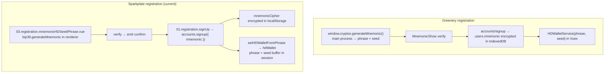
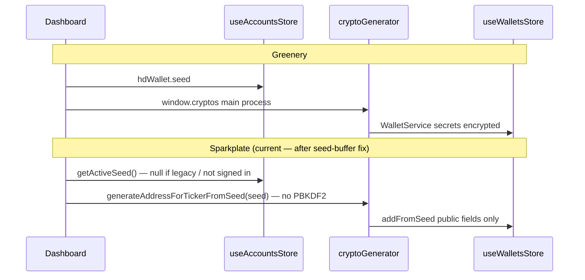

# Mnemonic seed phrase (account creation) → Dashboard wallet generation: Greenery vs Sparkplate.Fresh

**Date:** June 12, 2026 (`20260612`, executions-style `YYYYMMDD` schema) — **updated** after seed-buffer + registration-chain implementation
**Category:** Registration / HD seed custody / Dashboard wallet generation / Electron crypto bridge
**Status:** Findings + gap analysis + recommendations (partial implementation in progress)
**Related:**
- `docs/findings/20260612.findings.dashboard.wallet.address.generation.discarded.registration.mnemonic.md`
- `docs/findings/20260612.findings.hd.seed.buffer.precompute.signup.login.md` *(implemented)*
- `docs/findings/06122026.sparkplate.findings.dashboard.no.account.seed.available.md`
- `docs/findings/06122026.sparkplate.findings.dashboard.wallet.address.generation.md`
- `docs/findings/06102026.sparkplate.findings.greenery.login.auth.vuex.indexeddb.to.sqlite3.md`
- `docs/methodologies/06112026.methodology.electron.ipc.crypto.bridge.md`
- `docs/methodologies/10192025.methodology.sqlite3.database.implementation.md`
- `docs/executions/20260612.execution.vuex.to.pinia.store.conversion.md`

> Filename note: lives in `docs/findings/` but follows the **`docs/executions/` schema** (`YYYYMMDD.findings.<dotted.topic>.md`).

---

## Observation

Greenery and Sparkplate.Fresh both show a **recovery phrase at registration** and a **New Wallet** dropdown on the Dashboard. Sparkplate has now closed the **upstream registration chain** (phrase forwarded at signup, encrypted at rest, restored at login) and the **session seed-buffer gap** (PBKDF2 runs once per session; Dashboard reuses the buffer). The end-to-end path is **working for new accounts that register and stay signed in**, but Greenery parity is still incomplete: legacy accounts without `mnemonicCipher`, per-user wallet partitioning, derivation counters, network selection, IPC derivation, secret persistence, and true throwaway semantics remain open.

This document compares both stacks, inventories **remaining issues**, records **what has been fixed**, and recommends the next phased work.

---

## 0. Implementation progress (since initial draft)

| Milestone | Finding | Status | Code |
|-----------|---------|--------|------|
| Registration mnemonic forwarded to signup | `20260612…discarded.registration.mnemonic` | ✅ Done | `01.registration.signUp.vue` → `accounts.signup({ mnemonic })` |
| Encrypted phrase at rest (`mnemonicCipher`) | Same + login-auth findings | ✅ Done | `service.account.User.ts` |
| Session phrase at signup/login | Same | ✅ Done | `useAccountsStore.setHDWalletFromPhrase` |
| Precomputed seed buffer (no repeat PBKDF2) | `20260612…hd.seed.buffer.precompute` | ✅ Done | `service.wallet.HDWallet.ts`, `getActiveSeed()`, `addFromSeed()` |
| Dashboard HD path uses session seed | Same | ✅ Done | `Dashboard.vue` → `getActiveSeed()` → `addFromSeed()` |
| Separate HD vs throwaway handlers | `06122026…dashboard.wallet.address.generation` | ✅ Done | `onNewWalletFromMnemonic` / `onNewWalletThrowaway` |
| 5-wallet cap + unsupported-coin gating | Same | ✅ Done | `MAX_HD_WALLETS`, `GENERATABLE` set |
| No Dashboard phrase re-entry | `06122026…no.account.seed.available` | ✅ Policy | Seed from registration chain only; settings migration TBD for legacy |
| Full `HDWalletService` (index counter, IPC `generateWallet`) | This doc §1.1 / I12 | 🔲 Partial | Context only — counters/network/IPC not ported |
| Per-user wallets, auth gate, throwaway fix, SQLite secrets | Phase A–C below | 🔲 Open | — |

---

## 1. End-to-end flow comparison

### 1.1 Registration — mnemonic generation & verification

| Step | Greenery | Sparkplate.Fresh (current) | Parity |
|------|----------|------------------------------|--------|
| **Where phrase is generated** | Electron **main process** via `window.cryptos.generateMnemonic()` | Renderer in `03.registration.mnemonicHDSeedPhrase.vue` via `bip39.generateMnemonic(entropyBits)` | ⚠️ Different runtime; same BIP-39 standard if entropy/word-count valid |
| **Seed buffer precomputed** | Yes — signup/login hold `{ phrase, seed }` on the form / in `HDWalletService` | ✅ Yes — `createHDWalletContext()` at signup/login → `useAccountsStore.hdWallet` with `getActiveSeed()`; PBKDF2 once per session | ✅ Fixed (see `20260612…hd.seed.buffer.precompute`) |
| **User verification** | `MnemonicShow.vue` — re-enter 12 words | `03.registration.mnemonicHDSeedPhrase.vue` — verify step + import mode | ✅ Equivalent intent |
| **Custom / imported phrase** | `handleMnemonicSubmit` → `window.cryptos.generateMnemonic(customMnemonic)` | Import mode in `03.registration…` | ✅ Equivalent intent |
| **Phrase forwarded to signup** | `form.mnemonic.phrase` → `accounts/signup` | `emit('confirm')` → `handleSignup(mnemonic)` → `accounts.signup({ …, mnemonic })` | ✅ Fixed |
| **At-rest storage** | IndexedDB `users.mnemonic`, AES via `Cypher` middleware | `localStorage` `mnemonicCipher` (AES, password-derived key) | ⚠️ Encrypted in both; Sparkplate not yet on SQLite |
| **Post-signup HD context** | `new HDWalletService(mnemonic, email, …)` in Vuex `accounts.hdWallet` | ✅ `setHDWalletFromPhrase` → `hdWallet` ref (`HDWalletContext`: phrase + seed buffer) | ⚠️ Context yes; full service (counters, `generateWallet`) not yet |
| **Initial wallets on signup** | Optional `wallets/generateInitialWallets` (3× per visible coin) | None | ❌ Missing |



### 1.2 Login — restoring the account seed

| Step | Greenery | Sparkplate.Fresh (current) | Parity |
|------|----------|------------------------------|--------|
| **Unlock encrypted mnemonic** | `cypher.setEncryptionKey` → `userService.login` | `verifyLogin` + `decryptMnemonic(email, password)` | ⚠️ Same idea; different storage backend |
| **Rebuild HD context** | `window.cryptos.generateMnemonic(user.mnemonic)` → `{ phrase, seed }` → `HDWalletService` | ✅ `decryptMnemonic` → `setHDWalletFromPhrase` → `createHDWalletContext` (PBKDF2 once) | ✅ Fixed for accounts with `mnemonicCipher` |
| **Rehydrate wallets** | `wallets/fetchDBWallets(userId)` from IndexedDB | `useWalletsStore` from global `sparkplate_wallets` localStorage | ❌ Wrong partitioning model |
| **Session persistence on reload** | Vuex not persisted; re-login restores `hdWallet` | Pinia not persisted; re-login restores `hdWallet` via `authenticate` | ✅ Same threat model |
| **Legacy accounts** | N/A (all Greenery accounts have mnemonic) | No `mnemonicCipher` → `getActiveSeed()` null until migration or new registration | ❌ Migration gap |

### 1.3 Dashboard — "From Mnemonic" (HD wallet)

| Step | Greenery | Sparkplate.Fresh (current) | Parity |
|------|----------|------------------------------|--------|
| **Entry point** | `createWallet()` → `wallets/generateWallet` | `onNewWalletFromMnemonic()` → `walletsStore.addFromSeed(...)` | ✅ Same UI intent |
| **Seed source** | `accounts.hdWallet.seed` (after login) | ✅ `accountsStore.getActiveSeed()` — precomputed session buffer | ⚠️ Fixed when seed loaded; still null for legacy / unsigned-in |
| **Derivation runtime** | Main process `window.cryptos.generateWallet` | Renderer `generateAddressForTickerFromSeed(seed, ticker, index)` | ❌ No IPC bridge; different encoders |
| **Derivation index** | `email-coin-network-counter` in localStorage | `nextHdIndex()` = HD wallet count for ticker | ⚠️ Index reused if wallet removed |
| **Network** | `userSettings.networkSelection[coin]` | `useSettingsStore.networkSelection` **not used** in derivation | ❌ Mainnet-only |
| **5-wallet cap** | `initCreateWallet` max 5 | `MAX_HD_WALLETS = 5` | ✅ |
| **Auth gate** | Requires authenticated session + `hdWallet` | New Wallet gated on **active currency** only | ❌ |
| **What gets persisted** | Full wallet + secrets in IndexedDB | Public address only in `sparkplate_wallets` | ❌ |
| **Balances** | `wallets/getBalances` via IPC | Hardcoded `0` | ❌ Deferred |



### 1.4 Dashboard — "Throwaway Wallet"

| Step | Greenery | Sparkplate.Fresh (current) | Parity |
|------|----------|------------------------------|--------|
| **Mechanism** | `generateBasicWallet` — random keypair | `generateAndAddWallet` → random mnemonic → `addFromMnemonic` | ❌ Still HD from throwaway mnemonic, not random keypair |
| **Relation to account seed** | Unrelated | Unrelated | ✅ |
| **Secret persisted** | Yes — encrypted in IndexedDB | No | ❌ |

### 1.5 Dashboard wallet generation vs `currencyCore` — supported & "Not supported" currencies

Sparkplate's **currency catalog** (`src/lib/cores/currencyCore/currencies/index.ts`) defines **20 live tickers** in `NETWORKS` / `allCurrencies` — metadata, icons, import URIs, and (for many) rich per-coin modules under `currencyCore`. The Dashboard can **display** any of these when enabled in **Settings → Dashboard** (`useDashboardCurrencies` / `visibleCurrencies`).

**Wallet generation is a separate, much smaller set.** `Dashboard.vue` gates **New Wallet** with:

```334:334:Sparkplate.Fresh/src/views/Dashboard.vue
const GENERATABLE = new Set(['BTC', 'LTC', 'DOGE', 'ETH', 'SOL'])
```

When a currency is visible but **not** in `GENERATABLE`, the New Wallet button shows **"Not supported"** / **"Not supported in this build"** and does not derive an address.

**Why `currencyCore` coins can still be "Not supported":** the Dashboard HD pipeline is **hard-wired** to `@/utils/cryptoGenerator` via `useWalletsStore.addFromSeed()` → `generateAddressForTickerFromSeed()`. It does **not** call per-coin helpers in `currencyCore` (`deriveFromPrivateKey`, `generateWalletFromSeed`, etc.) even when those exist. So a coin can have rich metadata and import-time address logic in `src/lib/cores/currencyCore/currencies/*.ts` and still be non-generatable until either (a) a correct branch is added to `cryptoGenerator`, or (b) the wallet store is refactored to delegate to `currencyCore` / Phase B IPC.

#### Summary matrix

| Category | Count | Tickers | Why blocked (short) |
|----------|------:|---------|---------------------|
| **✅ Supported** | **5** | BTC, LTC, DOGE, ETH, SOL | Valid BIP-32/44 path in `cryptoGenerator` + listed in `GENERATABLE` |
| **⚠️ Broken encoder in `cryptoGenerator`** | **3** | TRX, XTZ, LUNC | Code exists in `cryptoGenerator.ts` but produces **invalid** addresses; excluded from `GENERATABLE` (issue **I5**). *Note:* `currencyCore` has **correct** `deriveFromPrivateKey` for these — Dashboard doesn't use it yet |
| **❌ No `cryptoGenerator` path** | **12** | ALGO, AR, ATOM, BCH, BNB, DOT, ETC, LUNA, STX, WAVES, XLM, XRP | No mnemonic→address branch in the Dashboard derivation pipeline |
| **🚫 Disabled in catalog** | **1** | ADA | Removed from `NETWORKS` — Cardano generation known broken |

**Total in `currencyCore` `NETWORKS`:** 20 tickers · **5 generatable** · **15 "Not supported"** on New Wallet.

#### ✅ Supported for public address generation (5)

| Ticker | Name | Why supported |
|--------|------|---------------|
| **BTC** | Bitcoin | `cryptoGenerator`: `m/44'/0'/0'/0/n` P2PKH. Matches Greenery main-process BTC. |
| **LTC** | Litecoin | `cryptoGenerator`: `m/44'/2'/0'/0/n` P2PKH. |
| **DOGE** | Dogecoin | `cryptoGenerator`: `m/44'/3'/0'/0/n` P2PKH. |
| **ETH** | Ethereum | `cryptoGenerator`: `m/44'/60'/0'/0/n` → `ethers.Wallet`. |
| **SOL** | Solana | `cryptoGenerator`: `m/44'/501'/n'/0'` → `@solana/web3.js` Keypair.fromSeed. |

Sources: `@/utils/cryptoGenerator.ts`, `Dashboard.vue` `GENERATABLE`, `useWalletsStore.addFromSeed`.

---

#### ⚠️ "Not supported" — encoder in `cryptoGenerator` but **invalid** (3)

These tickers have a `cryptoGenerator.ts` branch, but the address construction is a **placeholder** (raw `bs58` / string concat). They are **excluded from `GENERATABLE`** so the Dashboard never persists a malformed address. Greenery generates valid addresses for TRX, XTZ, and LUNC in the **main process** (`greenery/background/utils/cryptos/` — `xtz.js`, `lunc.js`; TRX via token/blockchain modules).

| Ticker | Name | What `cryptoGenerator` does wrong | Why that's "not supported" | Fix |
|--------|------|-----------------------------------|----------------------------|-----|
| **TRX** | Tron | `"T" + bs58.encode(Buffer.from("41" + privKeySlice))` — not Tron base58check with `0x41` prefix + double-SHA256 checksum | Address will not validate on Tron network; funds sent there are unrecoverable | Use `TRX.Tron.ts` `deriveFromPrivateKey` (TronWeb-style) or port Greenery encoder; add to `GENERATABLE` |
| **XTZ** | Tezos | `"tz1" + bs58.encode(hexSlice)` — skips Tezos `tz1` prefix bytes, blake2b-20 hash, and checksum | Not a valid implicit account (`tz1…`) | Use `XTZ.Tezos.ts` (blake2b + bs58check) or Greenery `xtz.js` |
| **LUNC** | Terra Classic | `"terra1" + bs58.encode(hexSlice)` — not bech32 with HRP `terra` | Not a valid Cosmos/Terra bech32 address | Use `LUNC.TerraClassic.ts` bech32 encoder or Greenery `lunc.js` |

**Important:** `currencyCore` already implements **correct** private-key→address for TRX, XTZ, and LUNC (`deriveFromPrivateKey` in each coin module). The gap is **integration** — Dashboard never routes mnemonic→seed→privkey→address through those modules.

---

#### ❌ "Not supported" — no `cryptoGenerator` / Dashboard HD path (12)

All listed in `NETWORKS` / `allCurrencies`. Users can enable them on the Dashboard (info, history, settings visibility), but **New Wallet** stays disabled because `generateAddressForTickerFromSeed` has no implementation and `GENERATABLE` excludes them.

| Ticker | Name | What `currencyCore` has | Why still "not supported" on Dashboard |
|--------|------|-------------------------|----------------------------------------|
| **ALGO** | Algorand | `ALGO.Algorand.ts`: `deriveFromPrivateKey` (Ed25519 → Algorand 58-char address) | Algorand HD from BIP-39 uses **Algorand-specific** 25-word derivation / Ed25519, not the secp256k1 BIP-32 tree `cryptoGenerator` uses. No `generateAddressForTickerFromSeed('ALGO')` branch. Import/private-key flows work; mnemonic HD on Dashboard does not. |
| **AR** | Arweave | `AR.Arweave.ts`: `deriveFromPrivateKey` (RSA-4096 / JWK-style wallet) | Arweave keys are **not** standard BIP-44 secp256k1 HD children. No seed→address path in `cryptoGenerator`. |
| **ATOM** | Cosmos | `ATOM.Cosmos.ts`: full `deriveFromPrivateKey` (secp256k1 → bech32 `cosmos1…`) | Correct encoder exists for **imported keys** only. No wired path: mnemonic → BIP-39 seed → `m/44'/118'/0'/0/n` → bech32 in Dashboard pipeline. |
| **BCH** | Bitcoin Cash | `BCH.BitcoinCash.ts`: `deriveFromPrivateKey` **and** `generateWalletFromSeed(seed, index, network)` | **`generateWalletFromSeed` exists in catalog but is unused by Dashboard.** Wallet store only calls `cryptoGenerator`, which has **no BCH** block. Greenery derives BCH in main process (commented legacy in `HDWalletService.js`). |
| **BNB** | BNB Beacon / BSC | `BNB.BinanceCoin.ts`: `deriveFromPrivateKey` (Ethereum-style `0x` for BSC) | No BCH/ETH-fork path at coin type **714** (`m/44'/714'/0'/0/n`) in `cryptoGenerator`. Greenery has `background/utils/cryptos/bnb.js`. Dashboard not wired. |
| **DOT** | Polkadot | `DOT.Polkadot.ts` + `ext.DOT.Polkadot/`: sr25519 & ed25519 `deriveFromPrivateKey`, SS58 addresses | Polkadot uses **Substrate** crypto (sr25519/ed25519), not secp256k1 BIP-32 from the shared root. Mnemonic HD needs `@polkadot/keyring` paths, not `cryptoGenerator`'s `bip32` factory. Used in import/Polkadot.js flows only. |
| **ETC** | Ethereum Classic | `ETC.EthereumClassic.ts`: `deriveFromPrivateKey` (same as ETH, different chain ID) | Trivially similar to ETH but coin type **61** (`m/44'/61'/0'/0/n`) is **not** implemented in `cryptoGenerator` (only coin type 60 for ETH). One missing branch — not wired. |
| **LUNA** | Terra 2.0 | `LUNA.Terra.ts`: `deriveFromPrivateKey` (bech32 HRP `terra`) | Post-Classic chain; **no** `cryptoGenerator` entry (only broken **LUNC** entry exists). Dashboard cannot derive `terra1…` from account seed. |
| **STX** | Stacks | `STX.Stacks.ts`: `deriveFromPrivateKey` (c32check / Bitcoin-derived Stacks addresses) | Stacks needs `m/44'/5757'/0'/0/n` + c32check encoding. `cryptoGenerator` has no STX block. Multi-format display exists in catalog UI only. |
| **WAVES** | Waves | `WAVES.Waves.ts`: `deriveFromPrivateKey` (Waves base58 + chain byte) | Proprietary Waves address format; no BIP-44 branch in `cryptoGenerator`. |
| **XLM** | Stellar | `XLM.Stellar.ts`: `deriveFromPrivateKey` (Ed25519 StrKey `G…`) | Stellar uses **Ed25519 StrKey**, not secp256k1 BIP-32 paths from the shared mnemonic root. No Dashboard HD integration. |
| **XRP** | Ripple / XRPL | `XRP.Ripple.ts`: `deriveFromPrivateKey` (ripple-keypairs, classic `r…` address) | XRP uses `m/44'/144'/0'/0/n` with **XRPL-specific** key derivation (not standard ETH-style). Greenery: `background/utils/cryptos/xrp.js`. No `cryptoGenerator` / Dashboard path. |

**Common pattern:** `currencyCore` was built for **import**, **private-key URI**, **calculator**, and **blockchain API** features — each coin exposes `deriveFromPrivateKey` where needed. The Dashboard **New Wallet** feature was added later with a **single shared** `cryptoGenerator` that only covers five secp256k1-friendly UTXO/account chains (+ three broken placeholders). Nothing bridges catalog capabilities to `addFromSeed`.

---

#### 🚫 Disabled in catalog — not in `NETWORKS` (1)

| Ticker | Name | Why "not supported" |
|--------|------|---------------------|
| **ADA** | Cardano | Explicitly **commented out** in `index.ts` (`// import { cardanoData } from './ADA.Cardano'; // DISABLED` — *"address generation issues"*). Not in `SupportedTicker`, `NETWORKS`, or `allCurrencies`. Cardano requires **CIP-1852** (extended keys, different from BIP-32 secp256k1). Cannot enable on Dashboard until a validated generation path exists. |

---

#### Master list — all currencies "Not supported" for public wallet addresses (15)

| Ticker | Block reason | Root cause category |
|--------|--------------|-------------------|
| TRX | Invalid `cryptoGenerator` encoder | Broken renderer path (I5) |
| XTZ | Invalid `cryptoGenerator` encoder | Broken renderer path (I5) |
| LUNC | Invalid `cryptoGenerator` encoder | Broken renderer path (I5) |
| ALGO | No Dashboard HD path | Non–BIP-32-secp256k1 / not in `cryptoGenerator` |
| AR | No Dashboard HD path | Non-HD (RSA) / not in `cryptoGenerator` |
| ATOM | No Dashboard HD path | Catalog `deriveFromPrivateKey` only — not wired to `addFromSeed` |
| BCH | No Dashboard HD path | `generateWalletFromSeed` in catalog **unused**; no `cryptoGenerator` block |
| BNB | No Dashboard HD path | Greenery IPC only; not in `cryptoGenerator` |
| DOT | No Dashboard HD path | Substrate sr25519/ed25519 — incompatible with shared bip32 root |
| ETC | No Dashboard HD path | Missing coin-type-61 branch (easy add; not done) |
| LUNA | No Dashboard HD path | No `cryptoGenerator` entry (distinct from LUNC) |
| STX | No Dashboard HD path | c32check / Stacks path not in `cryptoGenerator` |
| WAVES | No Dashboard HD path | Waves-specific encoding not in `cryptoGenerator` |
| XLM | No Dashboard HD path | Ed25519 StrKey not in `cryptoGenerator` |
| XRP | No Dashboard HD path | XRPL derivation not in `cryptoGenerator`; Greenery IPC only |

*(ADA is a 16th blocked ticker but is not in `NETWORKS` — users cannot select it on the Dashboard at all.)*

---

#### UX when unsupported

- **Header New Wallet:** `:disabled="… || !canGenerateActive"` — label **"Not supported"** when active ticker ∉ `GENERATABLE`.
- **Empty state CTA:** label **"Not supported in this build"** + copy: *"Wallet generation for **TICKER** is not supported in this build yet."*
- **Throwaway** uses the same gate — unsupported tickers cannot generate throwaway addresses either.

#### Closing the gap

| Priority | Action | Unblocks | Why |
|----------|--------|----------|-----|
| **Quick win** | Wire `addFromSeed` to `currencyCore` for coins that already have correct encoders (TRX, XTZ, LUNC, ATOM, BCH via `generateWalletFromSeed`, ETC as ETH fork) | 7+ tickers without waiting for IPC | Reuse existing `deriveFromPrivateKey` / `generateWalletFromSeed` after BIP-32 leaf key extraction |
| 1 | Phase B IPC — port Greenery `background/utils/cryptos/*` | BNB, XRP, remaining Greenery coins | Single authoritative encoder per coin |
| 2 | Fix or replace TRX / XTZ / LUNC in `cryptoGenerator` **or** route through `currencyCore` | 3 gated tickers | Stop using placeholder bs58 hacks |
| 3 | Add `cryptoGenerator` / IPC branches for ALGO, DOT, XLM, STX, WAVES, LUNA | Exotic crypto (Ed25519, sr25519, c32check) | Cannot reuse secp256k1 bip32 root alone |
| 4 | Expand `GENERATABLE` only **after** valid encoder verified on-chain | Each new ticker | Never persist malformed addresses |
| 5 | Re-enable ADA in catalog after CIP-1852 path | ADA | Currently disabled at source |

Until then, **`currencyCore` breadth ≠ Dashboard generatable breadth** — 20 visible catalog coins, 5 generatable public addresses, **15 blocked** with documented reasons above.

---

## 2. Issue inventory (Sparkplate.Fresh)

### P0 — Blocks correct HD generation

| # | Issue | Status | Symptom / notes |
|---|-------|--------|-----------------|
| **I1** | Session seed unavailable (legacy accounts, not signed in, post-reload before re-auth) | ⚠️ **Partial** — works after signup/login for accounts **with** `mnemonicCipher`; legacy still blocked | "No account seed available…" |
| **I2** | No per-user wallet partition (`sparkplate_wallets` global) | 🔲 Open | Cross-account wallet bleed; wrong index counts |
| **I3** | Throwaway uses HD from random mnemonic, not `generateBasicWallet` | 🔲 Open | Wrong semantics vs Greenery |

### P1 — Wrong or incomplete addresses

| # | Issue | Status |
|---|-------|--------|
| **I4** | Renderer derivation; no IPC bridge | 🔲 Open |
| **I5** | Invalid TRX / XTZ / LUNC encoders | 🔲 Open (mitigated by `GENERATABLE` gate) |
| **I6** | Network selection not threaded | 🔲 Open |
| **I7** | HD index from wallet count, not dedicated counter | 🔲 Open |

### P2 — Greenery parity gaps

| # | Issue | Status |
|---|-------|--------|
| **I8** | Public-only wallet persistence | 🔲 Open |
| **I9** | No initial wallets on signup | 🔲 Open |
| **I10** | Dashboard not gated on auth + seed | 🔲 Open |
| **I11** | Account seed in localStorage, not SQLite | 🔲 Open |
| **I12** | No full `HDWalletService` (counters, network, IPC `generateWallet`) | ⚠️ **Partial** — `HDWalletContext` + session refs only |
| **I13** | Balances always zero | 🔲 Open |

### P3 — Fixed or mitigated (do not regress)

| # | Item |
|---|------|
| ✅ | Registration mnemonic forwarded; `mnemonicCipher` encrypted at rest |
| ✅ | Precomputed seed buffer at signup/login (`hdWallet`, `getActiveSeed`, `addFromSeed`) |
| ✅ | Dashboard HD uses session seed — no repeat PBKDF2 per click |
| ✅ | Separate HD vs throwaway handlers; 5-wallet cap; `GENERATABLE` gating |
| ✅ | No Dashboard phrase re-entry (registration-seed-only policy) |

---

## 3. Root cause synthesis (updated)

**Was:** Sparkplate discarded the registration phrase, re-ran PBKDF2 every click, and had no session HD context.

**Now:** The registration → encrypted storage → login decrypt → **`hdWallet` seed buffer** → **`addFromSeed`** chain is in place for **new accounts**. Remaining failures are **downstream of Greenery parity**, not the broken registration link:

1. **Legacy / unsigned-in sessions** still have no seed (I1) — needs settings migration, not Dashboard prompts.
2. **Wallet list is global and public-only** (I2, I8) — needs per-user partition + SQLite secrets.
3. **Derivation semantics** differ from Greenery — renderer encoders, no network, weak index counter, wrong throwaway (I3–I7, I4–I6).
4. **Full `HDWalletService`** needs index counters + IPC `generateWallet` on top of the existing `HDWalletContext` (I12 partial).

---

## 4. Recommendations (revised phases)

### Phase A — Session reliability & wallet scoping *(next — no IPC)*

**Goal:** HD generation reliable and isolated per account; clear UX when seed is missing.

| Action | Addresses | Effort | Status |
|--------|-----------|--------|--------|
| **A1. Gate New Wallet on `loggedIn` + `getActiveSeed()`** | I1, I10 | Small | 🔲 **Do next** |
| **A2. Partition wallets by `userId`** | I2 | Medium | 🔲 **Do next** |
| **A3. Dedicated derivation counter** (`email-ticker-network-counter`) | I7 | Small | 🔲 **Do next** |
| **A4. Thread `networkSelection` into `addFromSeed` → `cryptoGenerator`** | I6 | Medium | 🔲 |
| **A5. Legacy seed migration in account settings** (password-gated; use `00.backup/modal.dashboard.mnemonic.vue` as UX base) | I1 | Medium | 🔲 |
| **A6. True throwaway: `generateBasicWallet` semantics** | I3 | Medium | 🔲 |
| ~~Seed buffer at signup/login~~ | I12 partial | — | ✅ **Done** |

**Acceptance:** New account → signup → sign in if needed → From Mnemonic × N works without PBKDF2 per click; wallets scoped to active user; legacy users guided to settings migration.

### Phase B — Electron IPC crypto bridge

**Goal:** Authoritative per-coin encoders matching Greenery.

| Action | Addresses | Notes |
|--------|-----------|-------|
| **B1. Port `background/utils/cryptos/*` + IPC** | I4, I5 | Per `06112026.methodology.electron.ipc.crypto.bridge.md` |
| **B2. Extend `service.wallet.HDWallet.ts`** with `generateWallet()`, index counter, network — delegate to `window.cryptos` | I12 | Builds on existing `HDWalletContext` |
| **B3. Route `useWalletsStore` through IPC** for production derivation | I4, I5 | Replace renderer as source of truth |
| **B4. `generateBasicWallet` IPC** | I3 | Throwaway path |

### Phase C — SQLite + encrypted secrets

| Action | Addresses |
|--------|-----------|
| **C1–C4.** SQLite schema, migrate `mnemonicCipher` + wallet secrets, `fetchDBWallets(userId)` on login | I8, I11, I2 |
| **C5.** Optional `generateInitialWallets` on signup | I9 |

### Phase D — Balances & tokens

| **D1.** Balance IPC on Dashboard mount | I13 |
| **D2.** Token wallet linking | Full Dashboard parity |

---

## 5. Suggested next steps (ordered)

These follow the closed registration + seed-buffer work and align with `20260612.execution…` Phase 4 / SQLite tracks.

### Immediate (Phase A — this sprint)

1. **A1 — Auth + seed gate on New Wallet**  
   Disable when `!accountsStore.loggedIn || !accountsStore.getActiveSeed()`; label e.g. "Sign in to generate wallets". Stops confusing errors for unsigned-in users.

2. **A2 — Per-user wallet partition**  
   Scope `useWalletsStore` persist key to active `userId` (or namespace `byTicker` on login). Prevents cross-account address bleed and fixes index semantics per user.

3. **A3 — Derivation counter**  
   Port Greenery's `getDerivationIndex` / `incrementWalletCounter` into `service.wallet.HDWallet.ts` (or adjacent module). Replace `nextHdIndex()` list-length heuristic.

4. **A5 — Legacy account migration (settings)**  
   Password-gated flow to write `mnemonicCipher` for accounts created before seed custody. Wire UX from `00.backup/modal.dashboard.mnemonic.vue` into **Settings → Security**, not Dashboard.

### Short-term (Phase A continued)

5. **A6 — Fix throwaway** — random keypair per coin, not `bip39.generateMnemonic` + HD.  
6. **A4 — Network in derivation** — read `useSettingsStore.networkSelection` in Dashboard → `addFromSeed` → `cryptoGenerator`.

### Medium-term (Phase B)

7. **IPC decision + B1** — port Greenery cryptos or document TS rewrite; unblock valid TRX/XTZ/LUNC and single encoder source.  
8. **B2 — Full `HDWalletService.generateWallet()`** — extend existing `HDWalletContext` with IPC delegation.

### Long-term (Phase C–D)

9. SQLite wallets + encrypted secrets; balances IPC; optional initial wallets on signup.

### Explicit non-goals

- **Do not** re-add Dashboard recovery-phrase entry — seed must flow from `03.registration.mnemonicHDSeedPhrase.vue` → signup → login only (`06122026…no.account.seed.available`).
- **Do not** persist the 64-byte seed buffer to disk — session only (already enforced).

---

## 6. File map (updated)

| Concern | Greenery | Sparkplate.Fresh |
|---------|----------|------------------|
| Mnemonic UI | `MnemonicShow.vue` | `03.registration.mnemonicHDSeedPhrase.vue` |
| Signup wiring | `RegistrationForm.vue` → `accountsModule.signup` | `01.registration.signUp.vue` → `useAccountsStore.signup({ mnemonic })` |
| Mnemonic IPC | `ipcMain/cryptos.js` `generateMnemonic` | Renderer `bip39` at registration; PBKDF2 in `createHDWalletContext` |
| Encrypted storage | IndexedDB + `Cypher` | `service.account.User.ts` → `mnemonicCipher` |
| Session HD context | `HDWalletService` in Vuex | ✅ `service.wallet.HDWallet.ts` → `useAccountsStore.hdWallet` |
| Session seed accessor | `hdWallet.seed` | ✅ `getActiveSeed()` |
| Dashboard HD action | `wallets/generateWallet` | ✅ `getActiveSeed()` → `addFromSeed()` |
| Dashboard throwaway | `generateBasicWallet` | `generateAndAddWallet` *(still wrong semantics)* |
| Derivation | Main process `window.cryptos` | Renderer `generateAddressForTickerFromSeed` |
| Index counter | `email-coin-network-counter` | `nextHdIndex()` from list length *(needs A3)* |
| Wallet persistence | `WalletService` / IndexedDB | `sparkplate_wallets` global, public only |
| Network | `networkSelection` → derivation | `networkSelection` *(unused)* |
| Currency catalog | `walletListConfig` / per-coin libs | `currencyCore/currencies/index.ts` — **20** `NETWORKS` tickers |
| Dashboard generatable subset | Most configured coins | `Dashboard.vue` `GENERATABLE` — **5** tickers; §1.5 |
| Legacy migration UX | — | Planned: settings + `00.backup/modal.dashboard.mnemonic.vue` |

---

## 7. Summary

Greenery connects registration → encrypted mnemonic → in-session **`HDWalletService` with precomputed seed** → main-process derivation with network + index → encrypted full-wallet persistence.

Sparkplate now implements **registration → encrypted `mnemonicCipher` → session `hdWallet` with precomputed seed → renderer `addFromSeed` without repeat PBKDF2 → public-only global wallet list**. That fixes the original discarded-mnemonic defect and the seed-buffer gap documented in `20260612…hd.seed.buffer.precompute`.

**What remains:** per-user wallet scoping, auth/seed UI gates, dedicated index counters, network-aware derivation, IPC encoders, true throwaway wallets, legacy migration in settings, and SQLite-backed secrets — in that priority order for Phase A before IPC/SQLite heavy lifts.

**Recommended immediate work:** **A1 + A2 + A3** (auth gate, per-user wallets, derivation counter), then **A5** (legacy settings migration).
